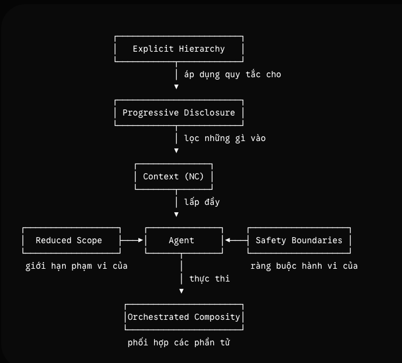

# Context

Trong phần này chúng ta sẽ đi tìm hiểu về Lý thuyết cơ bản của Agentic SDLC dựa trên 

# Detail 

## Nhầm tưởng Vibe Coding (Cliff)

Như chúng ta đã biết xu hướng hiện này AI phát triển nhanh chóng, để phát triển 1 phần mềm hay một tính năng trước thường phải mất từ 2-4 tuần hay thậm chí hàng tháng để release được, thì giờ đây chỉ cần vài giờ hay thậm chí là 30 phút là có thể có kết quả hay demo, chắc hẳn bạn cũng bắt gắp tình huống này rồi phải không, một enginner mở một editor lên , bắt đầu vibe coding nhưng dòng code, một loạt các dòng lệnh tự động chạy và chỉ sau 15p một bản demo tuyệt vời xuất hiện, ai nấy đều háo hức thích thú, lãnh đạo quyết định đầu tư vào mà muốn chạy tử (pilot)), Thật vậy điều này đã và đang diễn ra, tuy nhiên một demo đẹp chỉ là một bản MVP thôi , không có nghĩa là nó sẽ hiệu quả khi áp dụng, đặc biệt cho , nó khiến cho nhiều người nghi mình làm chủ và tạo ra một sản phẩm chất lượng. 
Thế rồi mọi việc sang những tháng tiếp theo, khi lượng code bắt đầu tăng dần, Agent bắt đầu kém thông minh hơn, hay đưa ra những lời kiểu "tôi quên", "xin lỗi bạn phải làm như thế này", khi không suy luận được nó bắt đầu bịa đặt ra những phương khác như kiểu như việc viết mới một logic khác ngay mặc dù trước đó logic này đã được đội ngũ thực hiện, bắt đầu treo hàng giờ đồng hồ. Toàn bộ các unittest, test case pass nhưng khi chạy thật thì phát sinh vấn đề. 

Đó cũng chính là sâu xa của việc nhầm tưởng, điểm nghẽn của Vibe Coding (Vibe Coding Cliff). Đối với một dự án mới ((greenfield) nơi chưa có rào cản (constraint) gì AI Agent thực sự làm tốt, nó được thoả sức thực hiện, sáng tạo. Nhưng chỉ sau vài tháng khi mà ngữ cảnh (context) tăng lên lúc này AI mới thực sự phát sinh nhiều vấn đề:
- Cạn kiệt về mặt ngữ cảnh (Context exhaustion): Hiện tại phần lớn ta thấy context chạm mốc tầm 100k hay 1M , nhưng với một doanh nghiệp một sản phẩm thì đều hơn 1M dòng code thậm chí có những nơi 10M hay 100M dòng code, đây mới thực sự là vấn đề, giới hạn ngữ cảnh khiến bạn không thể nhét hết vào AI được. Khi này AI chỉ làm việc với một ngữ cảnh rời rạc, không có ràng buộc, không có các tri thức ngầm (tribe knowledge).
- Giao diện ảo tưởng (Hallucinated interfaces): Khi context không đồng nhất rõ ràng, bạn sẽ bắt gặp AI tự bịa ra những gì nó nghĩ mà thực tế không hề tồn tại để đáp ứng yêu cầu của chúng ta và nó cho là nó đúng, build code, compile , test case đều thực sự mượt, bản thân chúng ta nếu quá phục thuộc cũng sinh ra ảo giác đó và chỉ tới khi đưa mọi thức lên production nó mới hực sự lộ diện 
- Vi phạm quy ước, quy tắc (Convention/Principle violations):  Mỗi team hay tổ chức đều có cách xử lý lỗi riêng, các tiêu chuẩn ghi log (logging), các ranh giới module. Không một điều nào trong số này hiển thị trước mắt agent trừ khi có ai đó tường mình làm cho chúng trở nên rõ ràng. agent không cố tình phá vỡ quy tắc của bạn. Nó chỉ là không biết chúng tồn tại.

Vấn đề này không phải của riêng AI Agent hay LLM nào, nó chỉ đơn giản là ranh giới đối với AI hay LLM tương tác với những dự án, hệ thống phức tạp. Đó là nguyên nhân vì sao mà phần lớn với tác vụ đơn giản , tính năng đơn giản thì đáp ứng được nhu cầu nhưng khi hẹ thống phình to, nghiệp vụ yêu cầu phức tạp thì đều không đáp ứng được. The Report từ Stack Overflow năm 2025 và phân tích biến động mã nguồn (code churn) của GitClear cho thấy khoảng 30–60% code do agent tạo ra cho các tác vụ phức tạp đòi hỏi phải sửa đổi lại rất nhiều, mặc dù chưa có nghiên cứu có kiểm soát nào đưa ra con số chính xác cuối cùng. Không phải vì các mô hình yếu, mà là vì ngữ cảnh quá yếu.

Kể cả những team có kinh nghiệm với hàng tá những chuyên gia những người sẵn sàng tiếp cận từ tính năng autocompleted tới agentic thì cũng đều gặp rào cản này trên production. Triệu chứng có thể khác nhau ví dụ như một sprint chỉ để danh cho dọn dẹp đống code do agent tạo ra vốn "chạy được" nhưng lại vi phạm mọi nguyên tắc kiến trúc; hay một đợt kiểm duyệt bảo mật (audit) phát hiện ra đầu ra của agent đã tìm cách bypass các cơ chế xác thực của team; hay một lập trình viên junior quá tin tưởng vào kết quả của agent mà một senior sẽ lập tức gắn cờ cảnh báo. Nhưng nguyên nhân gốc rễ thì luôn là một.

Cliff nằm ở chính thông tin thiếu hụt, dường như chúng ta quá tin tưởng cách AI đứa ra mà thiếu thông tin đánh giá (MIS). Và khi không đủ thì có 2 cách phổ biến mà mọi người thường làm đó là giới hạn AI (Guardrails), họ sẽ giới hạn scope của AI lại đôi khi chỉ ở mức support autocompleted và support generate ra các đoạn template. Ngược lại một số bên thì cố tìm cách thông qua việc vibe , tiếp tục cung cấp thêm các đoạn thông tin context cho AI với các promting dài hơn. Tuy nhiên cả 2 cách làm này đều không triệt để, chúng chỉ khiến mọi thứ tệ đi thôi.

### Tại sao công cụ không phải là giải pháp triệt để 

Bạn có thể thấy ngày nay các Mô hình Ngôn ngữ lớn từ các tổ chức doanh nghiệp lớn lien tục ra mắt cạnh tranh nhau từng điểm số , Grok, Claude, Gemini, Deepseek và GPT. Mỗi khi ra mắt các ngôn ngữ này đều thể hiện sự vượt trội hơn , và việc của chúng ta là chờ đợi họ ra model xịn hơn và dùng nếu như model cũ không giải quyết được và bạn có thấy vậy không.
Cách làm này đúng nhưng nó không phải triệt để. Chúng ta không thể lúc nào cũng chờ đợi 
một model toàn diện được, thời gian không cho phép hơn nữa kể cả vậy nó vẫn sẽ không thể đáp ứng được nhu cầu cao hơn của người dùng. Ngược lại ta lên hiểu về các đặc tính của ngôn ngữ lớn, bất kể là kiến trúc, nhà cung cấp (provider model) hay kích thước có thay đổi nào thì nó vẫn không đổi.
- Ngữ cảnh là hữu hạn và mong manh (Context is finite and fragile): mọi ngôn ngữ lớn hoạt động dều hoạt động dựa trên context, context luôn có có giới hạn, phân bổ các thông tin cũng sẽ ohân bổ không đều trên model. Khi bạn promting thông tin nó sẽ dựa trên các điểm để tập trung còn các thống tin khác sẽ ở xa. Bạn càng tăng thông tin đầu vào nếu không chính xác thì chỉ làm kết quả nhiễu, sai lệch thêm.
- Ngữ cảnh phải rõ ràng (Context must be explicit): Agent chỉ hiểu và hoạt động tốt khi những knowledge được cụ thể rõ ràng. Bất kỳ các thông tin gì không được gỉai thích haynằm trong  tài liệu chi thức của tổ chức mà tổ chức thường hay hiểu ngầm thì AI không thể hiểu được. Tương tự mã code của tổ chức thường chưa 2 thông tin, thông tin xác định qua document và những thông tin hiểu ngầm, và Agent nó chỉ có quyền truy cập vào những thông tin kiến thức mà thôi.
- Đầu ra mang tính xác suất (Output is probabilistic): Chắc bạn cũng gặp tình huống cùng một đầu vào có thể cho ra các đầu ra khác nhau. Các mô hình ngôn ngữ diễn dịch thay vì thực thi, sự biến thiên là đặc tính, không phải là lỗi. Tính nhất quán (determinism) đến từ các ràng buộc, cấu trúc và nền tảng dữ liệu (grounding), chứ không đến từ bản thân mô hình. Điều này có nghĩa là độ tin cậy phải được thiết kế theo kiến trúc, chứ không thể mặc định thừa nhận. Không giống như một trình biên dịch (compiler) sẽ chấp nhận hoặc từ chối code của bạn một cách rõ ràng, một mô hình ngôn ngữ luôn tạo ra một cái gì đó. khiến cho các lỗi về chất lượng trở nên âm thầm và hiểm hóc.

Dựa trên Ba tính chất này là lý do tại sao các mô hình tốt hơn không giải quyết được triệt để. Một mô hình mạnh mẽ hơn làm việc với một ngữ cảnh không cấu trúc, thiếu sót hoặc nhiễu loạn không nhất thiết tạo ra kết quả tốt hơn. Nó chỉ có thể tạo ra các câu trả lời sai một cách tự tin hơn, nhanh hơn. Trạng thái thất bại của một mô hình yếu thì rất rõ ràng: nó không làm được việc. Trạng thái thất bại của một mô hình mạnh với ngữ cảnh kém thì rất nguy hiểm: nó thường tạo ra đầu ra trông có vẻ hợp lý, có vẻ đúng nhưng lại âm thầm vi phạm các bất biến (invariants) trong hệ thống của bạn.

Theo thống kê Context length đã tăng khoảng 100–1.000 lần trong 5 năm qua, từ 2.048 token của GPT-3 vào năm 2020 lên đến 200.000–2.000.000 token ở các mô hình tiên phong hiện tại, thế nhưng mức độ hài lòng với AI trong các tác vụ kỹ thuật phức tạp vẫn không tăng trưởng tương ứng. Nút thắt cổ chai chưa bao giờ nằm ở dung lượng thô. Nó nằm ở cấu trúc của những gì lấp đầy dung lượng đó.

## PROSE Framework

Nếu bạn làm việc với Web hay trong Technology ngày nay chắc bạn cũng nghe tới giao thức REST hay RESTFul. Nó không phải là một phát minh mang innovation gì về mặt network cả mà thay vào đó nó đưa ra một số tuân thủ góp phần tạo lên một giao thức có khả năng mở rộng, độ tin cậy và khả năng tiến hóa độc lập.
- constraints
- statelessness
- uniform interface)
- layered system

PROSE dựa trên ý tưởng này để đinh nghĩa đối với việc phát triển phần mềm thuần AI (AI-native development). PROSE định nghĩa năm ràng buộc kiến trúc cho sự cộng tác giữa con người và AI, khi được áp dụng cùng nhau, sẽ giải quyết các thất bại mang tính hệ thống đã mô tả ở trên. Nó không phải là một công cụ, không phải một định dạng file, cũng không phải một kỹ thuật viết prompt. Nó là một phương pháp tiếp cận kiến trúc.
Năm ràng buộc và các trạng thái thất bại mà mỗi ràng buộc giải quyết:

| Ràng buộc (Constraint) | Nguyên lý (Principle) | Vấn đề giải quyết (Addresses) | Đặc tính tạo ra (Induced Property) |
| :--- | :--- | :--- | :--- |
| **Progressive Disclosure**  (Tiết lộ lũy tiến) | Ngữ cảnh đến đúng lúc (just-in-time), không đến để phòng hờ (just-in-case) | Quá tải ngữ cảnh, nạp mọi thứ ngay từ đầu làm lãng phí dung lượng và phân tán sự chú ý | Sử dụng ngữ cảnh hiệu quả |
| **Reduced Scope**  (Giảm thiểu phạm vi) | Khớp quy mô tác vụ với dung lượng ngữ cảnh | Phình to phạm vi, các tác vụ phình to vượt quá khả năng tập trung của một agent | Quản lý được độ phức tạp |
| **Orchestrated Composition**  (Hợp thành có điều phối) | Những thứ đơn giản thì hợp thành; những thứ phức tạp sẽ sụp đổ | Sụp đổ nguyên khối, một prompt siêu lớn duy nhất trở nên khó đoán và không thể debug | Tính linh hoạt và khả năng tái sử dụng |
| **Safety Boundaries**  (Ranh giới an toàn) | Tự trị trong khuôn khổ hành lang an toàn | Tự trị vô hạn, các hệ thống phi nhất quán sở hữu quyền hạn không giới hạn | Độ tin cậy và khả năng kiểm chứng |
| **Explicit Hierarchy**  (Phân cấp rõ ràng) | Độ đặc hiệu tăng lên khi phạm vi thu hẹp lại | Chỉ dẫn cào bằng, các hướng dẫn toàn cục làm ô nhiễm mọi ngữ cảnh bất kể tính phù hợp | Tính mô-đun và khả năng thích ứng miền |

Trong đó mỗi ràng buộc là bắt buộc để giải quyết trạng thái thất bại tương ứng của nó. Cùng nhau, năm ràng buộc này bao quát toàn bộ các trạng thái thất bại mà chúng tôi từng quan sát thấy trên mọi mã nguồn production mà mình nghiên cứu.
Những ràng buộc này nghe có vẻ trừu tượng. Ở phần sau của cuốn sách, chúng tôi sẽ theo dấu một pull request duy nhất sửa đổi 75 file và chứng minh những ràng buộc này tạo ra điều gì trong thực tế — phần nào chạy tốt và phần nào đòi hỏi con người phải can thiệp. Đó là bằng chứng thực tế, không phải lời quảng cáo. Toàn bộ chỉ số số liệu nằm trong bài nghiên cứu tình huống APM Overhaul.
Sự tương đồng với REST ở đây mang tính cụ thể, không phải để trang trí. Ràng buộc vô trạng thái của REST đồng nghĩa với việc các server không duy trì trạng thái phiên (session) giữa các request — điều này có vẻ như một sự hạn chế, nhưng lại tạo ra khả năng mở rộng (scalability). Ràng buộc Reduced Scope của PROSE đồng nghĩa với việc công việc phức tạp được phân rã thành các tác vụ có kích thước vừa vặn với ngữ cảnh sẵn có — điều này có vẻ chậm hơn, nhưng lại tạo ra chất lượng đồng nhất. Giao diện đồng nhất của REST đồng nghĩa với việc mọi tài nguyên được truy cập theo cùng một cách — có vẻ cứng nhắc, nhưng lại giúp các thành phần tiến hóa độc lập. Hệ thống Explicit Hierarchy của PROSE đồng nghĩa với việc các chỉ dẫn tạo thành một cây từ toàn cục đến cục bộ — có vẻ thủ tục, nhưng lại giúp thích ứng miền (domain adaptation) mà không làm ô nhiễm ngữ cảnh.
Trong cả hai trường hợp, các ràng buộc ban đầu đều tạo cảm giác giống như những hạn chế, cho đến khi bạn thấy được các đặc tính mà chúng tạo ra ở quy mô lớn. Và trong cả hai trường hợp, các ràng buộc đều độc lập với việc triển khai thực tế. REST không bắt buộc phải dùng Apache, và PROSE cũng không yêu cầu bất kỳ IDE hay nhà cung cấp AI cụ thể nào.
Các ràng buộc trong cuốn sách này đủ cụ thể để có thể, và đã được triển khai dưới dạng các thành phần tạo tác (artifacts) có thể đóng gói, phân phối với các schema chính thức.
Cách năm ràng buộc liên quan đến nhau:

[

Khi các ràng buộc này được tuân thủ, hệ thống sẽ thể hiện độ tin cậy (kết quả nhất quán từ các hệ thống phi nhất quán), khả năng mở rộng (cùng một pattern hoạt động tốt từ các script nhỏ cho đến các mã nguồn lớn), tính di động (chạy được trên bất kỳ nền tảng agent dựa trên LLM nào), và tính minh bạch (hành vi của agent có thể kiểm tra và giải trình được).
Khi chúng bị vi phạm, các thất bại cũng dễ đoán không kém:

| Anti-Pattern | Ràng buộc bị vi phạm | Điều gì sẽ hỏng |
| :--- | :--- | :--- |
| **Monolithic prompt**  (Prompt nguyên khối) | Orchestrated Composition | Tất cả chỉ dẫn nằm trong một khối đơn lẻ; những thay đổi nhỏ tạo ra kết quả khó đoán; không thể debug. |
| **Context dumping**  (Xả kho ngữ cảnh) | Progressive Disclosure | Mọi thứ được nạp lên ngay từ đầu; lãng phí dung lượng; làm loãng sự chú ý vào những phần quan trọng. |
| **Unbounded agent**  (Agent không biên giới) | Safety Boundaries | Không có giới hạn về công cụ hay quyền hạn; tính phi nhất quán cộng với quyền truy cập vô hạn tạo ra những hành vi không thể lường trước. |
| **Flat instructions**  (Chỉ dẫn cào bằng) | Explicit Hierarchy | Cùng một quy tắc áp dụng ở mọi nơi; các quy tắc bảo mật backend bị nạp lên ngay cả khi đang chỉnh sửa CSS của frontend. |
| **Scope creep**  (Phình to phạm vi) | Reduced Scope | Tác vụ phình to giữa phiên làm việc; agent mất dấu các chỉ dẫn ban đầu khi sự tập trung suy giảm. |

Hầu hết các anti-pattern này đều bắt nguồn từ một nguyên nhân gốc rễ duy nhất: ngó lơ việc ngữ cảnh là hữu hạn và mong manh, chúng ta sẽ tìm hiểu chi tiết này ở những phần sau.

REST không chỉ định nghĩa các ràng buộc nó đặt tên cho một tầng trong một cấu trúc phần mềm (computing stack) hoàn chỉnh. HTTP cung cấp tầng vận chuyển (transport), web server cung cấp môi trường chạy (runtime), REST cung cấp các ràng buộc kiến trúc, và mọi thứ phía trên (ngôn ngữ, trình quản lý gói, framework, ứng dụng) đều xây dựng trên nền tảng đó. Một stack tương đương đang hình thành cho việc phát triển agentic: LLM đóng vai trò xử lý, các harness (hệ thống khung) đóng vai trò là cỗ máy runtime biên dịch các luồng chỉ dẫn xác suất thành các lượt gọi công cụ nhất quán, các ràng buộc PROSE đóng vai trò là tiêu chuẩn điều phối, các phần tử markdown đóng vai trò là ngôn ngữ chung , các trình quản lý gói dùng để phân phối, và các framework mới nổi dùng để hợp thành. Ranh giới giữa một bộ máy xác suất và ranh giới nhất quán mà nó bước qua ở mỗi lượt gọi công cụ chính là tính năng kiến trúc chịu tải mà cuốn sách này coi trọng, các nhà lãnh đạo sẽ tiếp cận nó theo tên gọi ở Chương 4 và Phần III sẽ vận hành nó một cách chi tiết.

Andrej Karpathy từng nhận định rằng chúng ta đang ở "những năm 1980 của kỷ nguyên máy tính" đối với LLM, chúng xử lý tốt, nhưng các tầng phía trên nó thì vẫn còn phôi thai. Sự tương đồng này chuẩn xác về mặt cấu trúc: khoảng cách về độ chín giữa đáy stack và đỉnh stack chính là điều đã định hình nên kỷ nguyên PC sơ khai. Chương 4 sẽ bản đồ hóa stack này một cách chi tiết.

# Reference 

