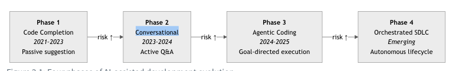

# Context

Trong phần này chúng ta sẽ nhìn nhận bức tranh toàn cảnh về AI - Native 

## Thực tại bạn đang ở đâu ?

Các lập trình viên ngày này đã và đang sử dụng các công cụ viết code bằng AI. Một số người thậm chí đã tự thanh toán các gói đăng ký cá nhân của mình. Một vài người khác thì đang đẩy mã nguồn qua các API mà bạn chưa từng kiểm toán bảo mật.
Câu hỏi lúc này không phải là liệu việc phát triển phần mềm hỗ trợ bởi AI có đang diễn ra trong tổ chức của bạn hay không. Mà là bạn đang ở đâu trong bản đồ AI này và có chủ động dẫn dắt nó, hay chỉ đang bị động ứng phó với nó?

## Tốc độ phát triển AI 

### Nhìn nhận thị trường

- Thị trường liên qua tới phát triển AI hỗ trợ lập trình viên ngày nay tăng trưởng nhanh chóng. Theo khảo sát năm 2024 của Stack Overflow cho thấy 76% lập trình viên đang sử dụng hoặc có kế hoạch sử dụng các công cụ viết code bằng AI, tăng mạnh so với con số 44% của năm 2023. Báo cáo Octoverse năm 2024 của GitHub thậm chí còn đưa ra con số cao hơn: 97% lập trình viên được khảo sát đã từng sử dụng các công cụ lập trình AI ở một mức độ nào đó. Ngay cả khi đã trừ hao sai số chọn mẫu (lập trình viên trên GitHub có xu hướng dễ tiếp nhận các công cụ lập trình mới hơn), thì xu hướng chuyển dịch này vẫn vô cùng rõ ràng.  
MD

- Phía provider đang chuyển dịch nhanh không kém phía consumer. Vào năm 2021, GitHub Copilot ra mắt dưới dạng thử nghiệm kỹ thuật (technical preview), một công cụ tự động hoàn thành mã nguồn (autocomplete) được vận hành bởi OpenAI Codex. Tính đến giữa năm 2025, thị trường đã có hơn mười sản phẩm được rót vốn dồi dào, trải dài từ hoàn thiện mã nguồn, lập trình dạng agentic (tác nhân tự trị), cho đến các nền tảng bao trọn vòng đời phát triển phần mềm. Các công ty (Cursor, Anthropic, Microsoft) tiết lộ các mức tăng trưởng nhanh chóng mặc dù doanh số định kỳ (ARR) chưa được tiết lộ.

- Trong bản Report của Gartner ước tính vào năm 2024, thì đến năm 2028, 75% kỹ sư phần mềm doanh nghiệp sẽ sử dụng các trợ lý mã nguồn AI, tương đương tăng vọt từ mức dưới 10% vào đầu năm 2023. Đường cong ứng dụng này không đi theo đường thẳng, nó đang tăng trưởng theo cấp số nhân. Đồng thời, các công cụ này không phải là những mục tiêu tĩnh, mỗi phiên bản lớn được phát hành lại mở rộng thêm định nghĩa về "phát triển phần mềm hỗ trợ bởi AI" (AI DLC), nghĩa là định nghĩa của thị trường này liên tục dịch chuyển ngay trong khi bạn đang cố gắng đánh giá nó.  

### Có ba yếu tố chính đang thúc đẩy làn sóng này

- Sự phổ thông hóa mô hình (Model commoditization): năm 2022, các mô hình của OpenAI là lựa chọn chính của hầu hết lập trình viên có thể tiếp cận thực tế để tạo mã nguồn với chất lượng production. Nhưng tới năm 2025, Claude của Anthropic, Gemini của Google, Llama của Meta, Deepseek, GLM và hàng loạt mô hình khác đã cạnh tranh, vị thế độc tôn của OpenAI không còn. Sự phổ thông này kéo tụt chi phí vận hành mô hình, từ đó làm giảm giá thành công cụ và thúc đẩy tỷ lệ ứng dụng tăng cao. Những công cụ từng thu phí rất đắt chỉ để cung cấp quyền truy cập mô hình giờ đây phải cạnh tranh bằng khả năng tích hợp, quản lý ngữ cảnh và thiết kế quy trình làm việc (workflow). Mô hình AI đang dần trở thành lớp hạ tầng phổ thông; sự khác biệt và giá trị cạnh tranh sẽ nằm ở toàn bộ các lớp phía trên nó.  
MD

- Sự đón nhận bắt nguồn từ lập trình viên (Developer-led adoption): Không giống như hầu hết các danh mục phần mềm ở các doanh nghiệp, khi một số lãnh đạo và phòng mua sắm (procurement) lựa chọn công cụ rồi áp đặt xuống cho nhân viên sử dụng, thì ngày nay khi mà việc build trở lên dễ dàng hơn thì các công cụ lập trình AI lan rộng từ dưới lên. Một lập trình viên dùng thử một công cụ, thấy làm việc nhanh hơn ở một số tác vụ nhất định, rồi giới thiệu cho ba đồng nghiệp khác. Đến khi ban lãnh đạo kỹ thuật nhận ra, thì 8 trên 12 lập trình viên trong một đội ngũ có thể đã đang sử dụng các công cụ khác nhau và không có công cụ nào được quản lý tập trung. Động lực này không mới (nó từng thúc đẩy sự bùng nổ của Slack, GitHub và Docker), nhưng tốc độ lần này dường như vượt trội so với các đường cong ứng dụng trước đây nhờ khả năng mang lại hiệu suất tức thì và rõ rệt trên từng tác vụ cá nhân.  

- Sự hợp nhất nền tảng (Platform consolidation): Các công cụ lập trình AI đang tiếp cận và là phần không thể thiếu trong vòng đời phát triển sản phẩm (SDLC). Những gì bắt đầu như một tính năng tự động hoàn thành (autocomplete) trong trình soạn thảo code giờ đây đã vươn tới kiến trúc (Architecture), kiểm thử (testing), đánh giá mã nguồn (code review), CI/CD, viết tài liệu (documentation) và triển khai (deployment). Điều này làm mờ đi ranh giới giữa "công cụ viết code" và "nền tảng phân phối phần mềm", một sự khác biệt cực kỳ quan trọng đối với các quyết định mua sắm của doanh nghiệp, nhưng lại là điều mà hầu hết các quy trình đánh giá hiện nay thường bỏ sót.

## Giao đoạn của AI Agent 

- Như chúng ta thấy với sự bùng nổ của AI Agent, các doanh nghiệp ,công ty đã chuyển mình theo từng mức độ trưởng thành ứng dụng AI. Hiện nay có 4 Phase

#### Phase 1
Code completion (2021-2023): trong giai đoạn này người dùng gõ một dòng chú thích (comment) hoặc một phần dòng code, hệ thống sẽ gợi ý các dòng code tiếp theo. GitHub Copilot, Tabnine, Amazon CodeWhisperer là ví dụ, các bên khác cạnh tranh chủ yếu về chất lượng gợi ý: tần suất gợi ý chính xác và hữu dụng. Mô hình tương tác ở đây mang tính bị động, lập trình viên viết code, công cụ đưa ra dự đoán. Tỷ lệ ứng dụng tăng nhanh nhờ khả năng tích hợp tối giản, tuy nhiên dưới góc setup phát triển thì chỉ là một plugin trong trình soạn thảo sẵn có, không yêu cầu thay đổi quy trình làm việc (workflow). Hầu hết các tổ chức vẫn coi công cụ lập trình AI là "phiên bản autocomplete tốt hơn". Nhiều nơi hiện nay vẫn đang dậm chân ở giai đoạn này.  
MD

#### Phase 2
- Conversational assistance (2023-2024): Với sự bùng nổ của ChatGPT trong giai đoạn cuối năm 2022 đã làm thay đổi kỳ vọng của người dùng. Các lập trình viên bắt đầu yêu cầu AI giải thích mã nguồn, tạo code mẫu (boilerplate), sửa lỗi (debug) và lập kế hoạch triển khai. Các công cụ nhanh chóng phản hồi giúp như Copilot Chat, Cursor, JetBrains AI Assistant và nhiều bên khác đã nhúng thẳng AI hội thoại vào môi trường lập trình. Mô hình tương tác chuyển sang chủ động hơn khi lập trình viên mở khung chat và mô tả ý định, AI sẽ tạo ra code, lập trình viên đánh giá và tích hợp nó vào hệ thống. Giai đoạn này xuất hiện một dạng lỗi mới (failure mode) nơi mà lập trình viên có thể giao phó các tác vụ lớn hơn cho AI, khiến chất lượng đầu ra trở nên khó kiểm chứng nhanh bằng mắt thường.  

#### Phase 3 
Agentic coding (2024-2025): Đây là ranh giới công nghệ hiện tại. Các agent không chỉ đơn thuần gợi ý code hay khung chat trả lời theo input từ người dùng, thay vào đó chúng còn thực hiện các tác vụ gồm nhiều bước như đọc file, chạy lệnh, sửa đổi nhiều file cùng lúc, thực thi kiểm thử (test) và lặp lại quy trình để sửa lỗi. Chế độ agent của GitHub Copilot, Claude Code, Composer của Cursor và Cascade của Windsurf đang hoạt động trong phân khúc này. Agent tự đọc ngữ cảnh, lên kế hoạch tiếp cận, hành động, đánh giá kết quả và lặp lại. Mô hình tương tác lại dịch chuyển lần nữa: lập trình viên mô tả mục tiêu, agent tự thực hiện công việc với các mức độ tự trị khác nhau, và lập trình viên kiểm tra kết quả cuối cùng. Đây chính là lúc Vibe Coding Cliff mà phần trước chúng ta đã giới thiệu hiện hữu và phức tạp, các agent hoạt động thiếu ngữ cảnh có cấu trúc sẽ tạo ra hàng loạt lỗi sai một cách đầy tự tin và trông cực kỳ hợp lý.  

#### Giai đoạn 4:  
Orchestrated SDLC (Đang định hình): Điểm tiên phong của thị trường, nơi các agent tham gia vào các khâu vượt ra ngoài trình soạn thảo code, bao gồm phân loại sự cố (issue triage), đánh giá mã nguồn (code review), kiểm thử, quản lý phát hành và vận hành hệ thống. Coding Agent của GitHub có khả năng tự gán issue cho một AI chạy trong môi trường đám mây, tự gửi yêu cầu kéo (pull request - PR) và phản hồi lại các ý kiến đánh giá. Claude Code của Anthropic có thể tự đọc issue và tạo PR một cách độc lập. Nhiều startup (như Devin, Factory, Codegen) cũng đang xây dựng các quy trình làm việc tương tự. Chưa có tổ chức nào công bố việc tự động hóa hoàn toàn quy trình SDLC từ đầu đến cuối ở quy mô production thực tế, nhưng các mảnh ghép cho những quy trình tự động hóa đa giai đoạn đầu tiên đã sẵn sàng. Ở giai đoạn này, việc thiết lập cơ chế quản trị (governance) là bắt buộc.

[

Theo đánh giá thì hiện nay phần lớn các doanh nghiệp, SME đều đang tiệp cận ở giữa 1 và 2, một số tổ chức thì đang ở mức 3. còn đối với cá nhân hay các lập trình viện thì đang tiệm cật 3 thì 

## 

Hiện này các công cụ lập trình AI và Software delivery Platform có một danh giới xen kẽ nhau, bạn sẽ thấy các công cụ AI đang dần tích hợp các tính năng mà các nền tảng (Platform) đang hỗ trợ ví dụ như Cursor hay Claude tích hợp các luồng đánh giá mã nguồn, delivery và ngươc lại các Platform như Github Co Pilot cũng tích hợp thêm các việc đánh viét code và giá code. Điều này làm cho danh giới bị xoá loà, tuy nhiên vẫn cần phải phân biệt rõ để đưa ra các quyết định mua sắm hợp lý. Thông thường sai nhầm của doanh nghiệp là đánh giá các quyết định về Platform bằng tiêu chí của công cụ lập trình (“công cụ nào có tính năng tự động hoàn thành mã tốt nhất?”), hoặc ngược lại, đánh giá các quyết định về công cụ lập trình bằng tiêu chí của nền tảng (“nó có tích hợp được với hệ thống đăng nhập một lần SSO của chúng ta không?”).

Các công cụ lập trình AI (AI coding tools) tối ưu hóa vòng lặp bên trong (inner loop) — tức là chu kỳ chỉnh sửa - đóng gói - chạy thử (edit-build-test) mà một lập trình viên thực hiện hàng chục lần mỗi ngày. Chúng hoạt động ngay trong trình soạn thảo code. Giá trị cốt lõi của chúng là tốc độ và chất lượng ngay tại thời điểm tạo ra mã nguồn. Cursor, Claude Code, Windsurf, GitHub Copilot (phiên bản trong trình soạn thảo) và Amazon Q Developer đang cạnh tranh trong phân khúc này. Lập trình viên là người chủ động lựa chọn các công cụ này. Quá trình ứng dụng diễn ra từ dưới lên (grassroots), được thúc đẩy bởi từng cá nhân nhà phát triển.  
MD

Các nền tảng phân phối phần mềm (Software delivery platforms) tối ưu hóa toàn bộ vòng đời phát triển — từ bước lên ý tưởng cho đến khâu vận hành trên môi trường production. Chúng bao trùm từ quản lý mã nguồn (source control), CI/CD, quét bảo mật (security scanning), đánh giá mã nguồn (code review), triển khai (deployment) cho đến giám sát hệ thống (monitoring). Chúng cung cấp khả năng quản trị: ai đã làm gì, vào lúc nào, với thẩm quyền gì và có nhật ký kiểm toán (audit trail) ra sao. GitHub, GitLab, Azure DevOps và Atlassian đang cạnh tranh ở phân khúc này. Các tổ chức là bên lựa chọn các nền tảng này. Đây là một quyết định từ ban lãnh đạo.

Một số tiêu chi đánh giá để lựa chọn 

| Tiêu chí (Criterion) | AI coding tool | Software delivery platform |
| :--- | :--- | :--- |
| **Người quyết định** *(Who decides)* | Từng lập trình viên cá nhân | Ban lãnh đạo kỹ thuật (Engineering leadership) |
| **Giá trị cốt lõi** *(Primary value)* | Tốc độ và chất lượng viết code | Quản trị vòng đời và tự động hóa |
| **Phạm vi đánh giá** *(Evaluation scope)* | Trải nghiệm trên trình soạn thảo, chất lượng mô hình | Bảo mật, tuân thủ quy trình, nhật ký kiểm toán (audit trails) |
| **Rủi ro nếu thiếu quản trị** *(Risk if ungoverned)* | Chất lượng code không đồng nhất | "Shadow IT" (sử dụng công nghệ ngoài luồng), rò rỉ rủi ro về tuân thủ pháp lý |
| **Chi phí chuyển đổi** *(Switching cost)* | Thấp (chỉ là plugin của trình soạn thảo) | Cao (ảnh hưởng tới CI/CD, phân quyền, lịch sử dữ liệu) |
| **Mức độ bao phủ SDLC** *(SDLC coverage)* | Viết code (+ đang mở rộng thêm) | Từ bước lên ý tưởng (Ideate) cho đến khâu vận hành (Operate) |

## Năng lực AI 

Khi đánh giá lựa chọn AI bên cạnh mức độ trưởng thanh chia rõ ở các phase thì chúng ta cũng cần nhìn nhận năng lực của tổ chức và của đối tác. dưới góc nhìn của Head of IT không nên nhìn vào các tính năng cơ bản (chat, autocomplete) mà phải tập trung vào 3 yếu tố:
**Custom instructions / rules (Chỉ dẫn tùy chỉnh)**: Cơ chế để nạp tự động quy tắc/kiến trúc của đội ngũ vào AI (như .cursor/rules, CLAUDE.md, .github/copilot-instructions.md).
**Enterprise governance (Quản trị doanh nghiệp)**: Bảo mật, SSO, lịch sử kiểm toán để đảm bảo tuân thủ quy trình của tổ chức.
**Autonomous PR & Code Review (Agent tự trị)**: Năng lực tự động hóa quy trình mở PR và duyệt code ở mức độ tự trị cao.

## Chi Phí (Costing)

Một điều quan trọng không kém, chi phí cũng là một trong những đánh giá để lựa chọn. Thông thường 3 mô hình kinh doanh/chi phí mà các provider AI cũng cấp

**Đăng ký theo số lượng người dùng (Per-seat subscription)**: Trả phí cố định hàng tháng trên mỗi lập trình viên (ví dụ: Copilot, Cursor, Windsurf).
**Dựa trên mức độ sử dụng (Usage-based)**: Định giá theo lượt gọi API (ví dụ: các công cụ như Claude Code) — bạn trả tiền dựa trên số lượng token đã tiêu thụ.
**Gói tích hợp nền tảng (Platform-bundled)**: Các tính năng AI được gộp chung vào một gói dịch vụ DevOps hoặc đám mây rộng hơn (như trường báo hợp của Amazon Q và GitHub Enterprise).
**doanh nghiệp (Enterprise tiers)**: Một lựa chọn khác với các tính năng bổ sung riêng cho doanh nghiẹp nhưng chi phí có thể cao gấp 2-4 lần gói bình thường.

Tóm lại khi thảo luận về ngân sách, câu hỏi cốt lõi thực sự không phải là "Công cụ này tốn bao nhiêu tiền?" mà là "Chi phí của công cụ này là bao nhiêu so với lượng thời gian của lập trình viên mà nó tiết kiệm được, và liệu mức phí chênh lệch để có các tính năng quản trị của gói doanh nghiệp có xứng đáng để giúp tổ chức tránh được chi phí khắc phục hậu quả từ shadow IT (việc nhân viên tự ý dùng các công cụ bên ngoài) hay không?.

## Buy or Build and Trending Buy

Một trong những vấn đề trong hệ thống thông tin của một tổ chức (MIS) vẫn luôn luôn là một lựa chọn cho câu hỏi chúng ta sẽ lên xây ay lên mua. Với sự hỗ trợ của AI ngày nay khi chi phí phát triển near zero thì việc Build không còn taketime và khó như trước nữa.

## 8-Phase Evaluation Framework

Hầu hết các đợt đánh giá công cụ AI đều chỉ tập trung vào giai đoạn viết code. Điều này giống như việc đánh giá một chiếc ô tô mà chỉ chạy thử mỗi động cơ, bạn biết được vài thứ, nhưng lại bỏ lỡ mọi yếu tố quyết định xem liệu chiếc xe đó có thực sự đưa bạn đến được nơi cần đến hay không. Quy trình phân phối phần mềm trải dài qua 8 giai đoạn. Nếu bạn chỉ đo lường tác động của AI trên một giai đoạn duy nhất, bạn không phải đang đánh giá, bạn đang đoán mò.

Một thông tin chuyên sâu mà hầu hết các tổ chức thường bỏ lỡ: Tạo mã nguồn (code generation) là giai đoạn hoàn thiện nhất, giai đoạn sở hữu các công cụ mạnh mẽ nhất và có tỷ lệ áp dụng cao nhất. Trong khi đó, Lên kế hoạch (Plan), Kiểm thử (Test), và Thẩm định (Review) mới là nơi làn sóng hỗ trợ AI giá trị cao tiếp theo sẽ đổ bộ, và cũng là nơi mà ngữ cảnh có cấu trúc (loại ngữ cảnh mà cuốn sách này hướng dẫn bạn xây dựng) tạo nên sự khác biệt giữa tự động hóa hữu ích và những tiếng nhiễu loạn đắt đỏ.

| Giai đoạn | Điều gì diễn ra | Thế nào là "Tốt" | Trạng thái hiện tại |
| :--- | :--- | :--- | :--- |
| **Ý tưởng** *(Ideate)* | Thu thập yêu cầu, nghiên cứu, khám phá. | Agent tìm ra các giải pháp tương tự đã có trước đây (prior art), soạn thảo tài liệu đặc tả từ các ghi chú sơ sài, và gắn cờ cảnh báo các yêu cầu xung đột nhau trước khi con người bắt tay vào thực hiện theo một hướng đi cụ thể. | ☐ Tự động hóa ☐ Có hỗ trợ ☐ Thủ công |
| **Lập kế hoạch** *(Plan)* | Đưa ra quyết định kiến trúc, phân rã tác vụ, ước lượng thời gian. | Agent tự động tạo các tài liệu quyết định kiến trúc (ADR), phân rã các epic (nhóm tính năng lớn) thành các tác vụ có kích thước vừa phải, và vẽ ra các biểu đồ phụ thuộc (dependency graphs) để tech lead duyệt lại, thay vì họ phải tự xây dựng từ đầu. | ☐ Tự động hóa ☐ Có hỗ trợ ☐ Thủ công |
| **Viết code** *(Code)* | Triển khai thực tế, tạo mã nguồn, tối ưu cấu trúc code (refactoring). | Agent tạo ra đoạn code tuân thủ các quy ước của bạn, gọi đúng các API thực tế, và vượt qua công cụ linter ngay trong lần thử đầu tiên — chứ không chỉ dừng lại ở việc code biên dịch thành công. | ☐ Tự động hóa ☐ Có hỗ trợ ☐ Thủ công |
| **Build** *(Build)* | Biên dịch, giải quyết các thư viện phụ thuộc, đóng gói. | Agent chẩn đoán các lỗi build thất bại, đề xuất các phương án sửa lỗi thư viện phụ thuộc, và xử lý các lỗi CI mà không cần con người phải đọc toàn bộ file log dài dằng dặc. | ☐ Tự động hóa ☐ Có hỗ trợ ☐ Thủ công |
| **Kiểm thử** *(Test)* | Kiểm thử đơn vị (unit tests), kiểm thử tích hợp, tự động tạo test. | Agent tạo ra các bài kiểm thử bao quát được các trường hợp biên (edge cases) mà đội ngũ của bạn thường phải viết tay, giúp tăng độ bao phủ (coverage) một cách thực chất chứ không chỉ nhại lại phần triển khai của code. | ☐ Tự động hóa ☐ Có hỗ trợ ☐ Thủ công |
| **Thẩm định** *(Review)* | Đánh giá code, đánh giá bảo mật, kiểm tra các tiêu chuẩn. | Agent phát hiện ra các lỗi thực tế — chứ không phải các lỗi vặt về phong cách trình bày (style nits) — và đưa ra các nhận xét review đủ cụ thể để tác giả đoạn code có thể hành động ngay mà không cần thảo luận thêm. | ☐ Tự động hóa ☐ Có hỗ trợ ☐ Thủ công |
| **Phát hành** *(Release)* | Triển khai, quản lý phát hành, tạo nhật ký thay đổi (changelog). | Agent soạn thảo changelog từ lịch sử commit, gắn cờ cảnh báo các thay đổi có thể gây lỗi hệ thống (breaking changes), và tự động hóa các phần mang tính thủ tục của đợt phát hành để con người tập trung vào quyết định go/no-go (phát hành hay không). | ☐ Tự động hóa ☐ Có hỗ trợ ☐ Thủ công |
| **Vận hành** *(Operate)* | Giám sát, phản ứng sự cố, khả năng quan sát hệ thống (observability). | Agent liên kết các cảnh báo lỗi với các đợt triển khai gần nhất, soạn thảo dòng thời gian xảy ra sự cố và đề xuất các hành động rollback (khôi phục phiên bản cũ) — giúp giảm thời gian trung bình để chẩn đoán lỗi (MTTD) chứ không thay thế phán đoán của người trực ca. | ☐ Tự động hóa ☐ Có hỗ trợ ☐ Thủ công |

Tám giai đoạn này được nhóm lại thành ba nhóm lớn tương ứng với cách các nhà lãnh đạo lập kế hoạch và ngân sách:

**Intent (Ý tưởng + Lập kế hoạch)**: Chúng ta đang xây dựng cái gì và tại sao?

**Build (Viết code + Build + Kiểm thử + Thẩm định)**: Biến ý định thành phần mềm đã được xác thực.

**Operate** : Đưa phần mềm đến tay người dùng và duy trì hoạt động ổn định.

Tính đến giữa năm 2026, hầu hết các tổ chức đều tập trung sự hỗ trợ của agent vào giai đoạn Viết code, phủ được một phần ở giai đoạn Kiểm thử và Thẩm định, và có rất ít hoặc không có sự hỗ trợ nào ở các giai đoạn còn lại. Đó không phải là một thất bại, viết code là giai đoạn dễ tự động hóa nhất và các công cụ đã bắt đầu từ đó. Nhưng như vậy là chưa hoàn chỉnh, và nếu dừng lại ở đó nghĩa là bạn đang tối ưu hóa phần rẻ tiền nhất của cả quy trình.
Những lợi ích có giá trị cao nhất trong vòng 12–18 tháng tới sẽ đến từ việc mở rộng sự hỗ trợ của agent sang các giai đoạn Lập kế hoạch, Kiểm thử và Thẩm định, những giai đoạn mà chi phí nhân sự rất đắt đỏ, vòng phản hồi (feedback loops) diễn ra chậm, và là nơi ngữ cảnh có cấu trúc có thể thúc đẩy quá trình tự động hóa một cách đáng tin cậy.
Hãy đánh dấu tích vào các ô phù hợp với tổ chức của bạn. Xu hướng của các dấu tích sẽ cho bạn biết mình đã được phủ ở đâu, các lỗ hổng đang nằm ở đâu, và dự án thử nghiệm tiếp theo của bạn nên tập trung vào chỗ nào.

## Rủi ro AI 

Vị thế nguy hiểm nhất trong thị trường hiện tại là "chờ và xem" (wait and see). Hành động này mang lại cảm giác của sự thận trọng. Nhưng thực chất nó lại là một quyết định — quyết định để mặc cho các lập trình viên tự ý lựa chọn công cụ, trì hoãn việc thiết lập quy chế quản trị cho đến khi một sự cố rò rỉ dữ liệu buộc bạn phải đối mặt, và chấp nhận tụt hậu so với các tổ chức đang tích cực xây dựng hệ thống ngữ cảnh có cấu trúc giúp công cụ AI vận hành đáng tin cậy.
Dưới đây là những cái giá mà chiến lược "chờ và xem" bắt bạn phải trả:
Rủi ro về nhân tài (Talent risk): Lập trình viên ngày càng coi các công cụ hỗ trợ AI là tiêu chuẩn làm việc bắt buộc phải có. Một khảo sát do GitHub ủy quyền vào năm 2023 (thực hiện bởi Wakefield Research trên 500 lập trình viên doanh nghiệp Mỹ tại các công ty có hơn 1.000 nhân viên) cho thấy 92% người được hỏi đang sử dụng các công cụ lập trình AI cho công việc hoặc mục đích cá nhân.⁵ Việc không cung cấp bất kỳ công cụ AI chính thức nào — hoặc giới hạn chúng ở tính năng autocomplete cơ bản — sẽ khiến tổ chức của bạn giảm bớt sức hút đối với những kỹ sư mà bạn đang cạnh tranh gay gắt để tuyển dụng và giữ chân.
Rủi ro từ Shadow IT (Shadow IT risk): Mỗi tháng trôi qua mà không có một công cụ được phê duyệt chính thức là một tháng các lập trình viên tự tìm kiếm giải pháp riêng của họ. Mỗi công cụ tự phát này lại mang đến những dấu hỏi về quyền lưu trú dữ liệu, nguy cơ rò rỉ sở hữu trí tuệ (IP) và các lỗ hổng tuân thủ pháp lý vốn sẽ tích tụ dần theo thời gian. Chi phí khắc phục để giải quyết hậu quả từ 6 tháng sử dụng AI "chui" là không hề nhỏ.
Rủi ro tích lũy ngữ cảnh (Context accumulation risk): Đây là cái giá ít rõ ràng nhất nhưng lại mang lại hệ quả nặng nề nhất. Những tổ chức đang đầu tư ngay từ bây giờ vào hệ thống ngữ cảnh có cấu trúc — các quy ước được ghi chép lại, các quyết định kiến trúc ở định dạng máy có thể đọc được, các bộ chỉ dẫn được tinh lọc kỹ lưỡng — đang xây dựng một tài sản có giá trị tích lũy tăng dần. Công cụ AI của họ sẽ ngày càng đáng tin cậy hơn theo thời gian. Trong khi đó, hệ thống của bạn — khi bạn bắt đầu áp dụng muộn màng — sẽ phải xuất phát từ con số không tròn trĩnh. Khoảng cách giữa "áp dụng từ năm 2025" và "đợi đến năm 2027 mới áp dụng" không đơn thuần là 2 năm sử dụng công cụ — mà là 2 năm tích lũy ngữ cảnh mà các agent của người đi trước có thể khai thác, còn agent của bạn thì không. Chương 4 sẽ phân tích sâu sắc khía cạnh này.
Rủi ro cạnh tranh (Competitive risk): Nếu đối thủ cạnh tranh của bạn ra mắt tính năng mới nhanh hơn vì kỹ sư của họ có thể giao phó các phần việc triển khai lặp đi lặp lại cho agent, trong khi kỹ sư của bạn vẫn phải tự tay làm, thì khoảng cách về mặt năng suất không còn là lý thuyết suông nữa. Nó sẽ thể hiện rõ rệt qua tần suất phát hành sản phẩm, thời gian đưa sản phẩm ra thị trường (time-to-market) và chất lượng của các bài toán thực tế mà các kỹ sư của bạn dành sự tập trung để giải quyết.