# Context

Trong phần này chúng ta sẽ bắt đầu với một project đơn giản trong bmad

# # Cài đặt và sử dụng

## Yêu cầu cài đặt (Prerequisites)
- Node.js > 20.12
- Python uv
- Git — quản lý phiên bản source code
- Claude Code cli hoặc IDE như Cursor, VSCode

### Bước 1: Thực hiện tạo bmad với lệnh

```bash
npx bmad-method install
```

BMAD sẽ tiến hành việc hỏi chúng ta cung cấp các thông tin
1. Chọn vị trí cài đặt
2. Chọn công cụ AI
3. Chọn module
4. Chọn ngôn ngữ sử dụng với agent
5. Chọn nội dung ngôn ngữ hiển thị cho phần tài liệu
6. Chọn đường dẫn lưu bạn muốn lưu

[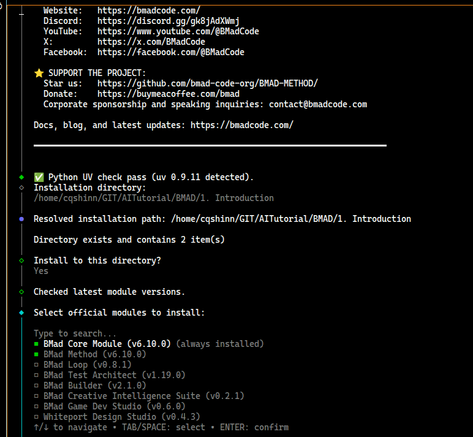

sau khi chạy bmad sẽ list một số cấu trúc module để bạn cài đặt, trong phần này chúng ta chỉ sử dụng mặc định `BMa`d Method`.

_bmad/ — agents, workflows, tasks và cấu hình
_bmad-output/ — đây là nơi các artifact của bạn sẽ được lưu

[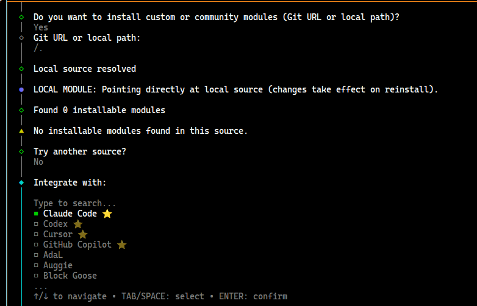

Bmad sẽ hỏi thông tin để bắt đầu tiến hành tạo cấu trúc thư mục

[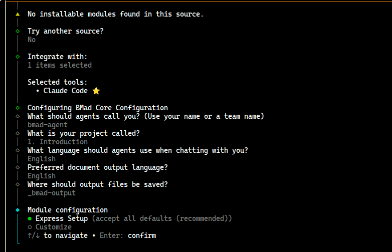

Sau khi accept tất cả các folder sẽ được tạo ra


```bash
your_project/
├── _bmad/
│   ├── bmm/            # Các module bạn đã chọn
│   │   └── config.yaml # Cài đặt module (nếu bạn cần thay đổi sau này)
│   ├── core/           # Module core bắt buộc
│   └── ...
├── _bmad-output/       # Các artifact được tạo ra
├── .claude/            # Claude Code skills (nếu dùng Claude Code)
│   └── skills/
│       ├── bmad-help/
│       ├── bmad-persona/
│       └── ...
└── .cursor/            # Cursor IDE skills (nếu dùng Cursor)
    └── skills/
        └── ...
```

[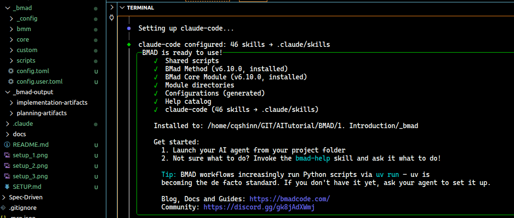

### Bước 2: khởi tạo session với ide hay cli của bạn đã lựa chọn trước đó

lúc này agent sẽ loạt context của bmad vào và cho phép chúng ta sử dụng

[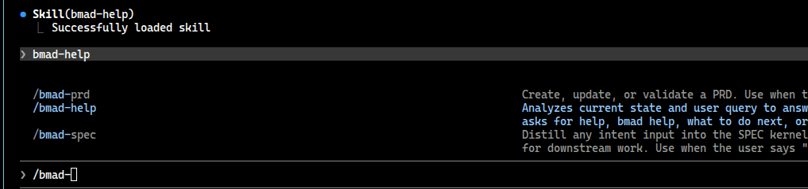

Sử dụng
```bash
/bmad-help
```
để xác minh mọi thứ hoạt động và xem bạn nên làm gì tiếp theo

Note: Bmad Help là một command mạnh của BMAD giúp người du dùng tham khảo hay thực hiện các quyết định.

[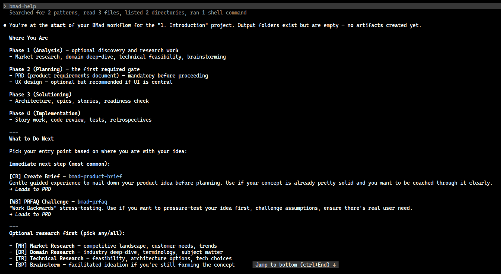

### Bước 3: Tạo Project và Plan

trước khi vào, hay nhắc BMAD đẻ tạo file ```project-context.md``` để ghi lại các ưu tiên kỹ thuật và quy tắc triển khai. Nhờ vậy mọi AI agent sẽ tuân theo cùng một quy ước trong suốt dự án.

```bash
/bmad-generate-project-context
```

[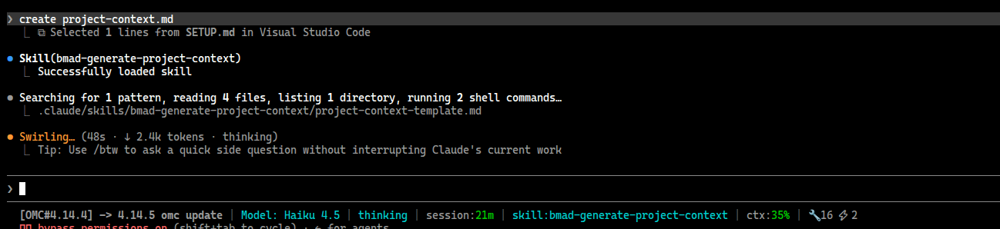

Trong trường hợp agent không thể generate đc file, bạn có thể tạo manual trong `bmad-output/project-context.md`

### Bước 4: Đưa ra yêu cầu phân tích (Analysis) phase 1

Đối với phase phân tích, BMAD đưa ra một loạt các command hỗ trợ cho workflow

brainstorming (bmad-brainstorming) — Gợi ý ý tưởng có hướng dẫn
research (bmad-market-research / bmad-domain-research / bmad-technical-research) — Nghiên cứu thị trường, miền nghiệp vụ và kỹ thuật
product-brief (bmad-product-brief) — Tài liệu nền tảng được khuyến nghị khi concept của bạn đã rõ
prfaq (bmad-prfaq) — Bài kiểm tra Working Backwards để stress-test và rèn sắc concept sản phẩm của bạn

trong mục này ta chỉ focus vào lựa chọn ```bmad-brainstorming```

[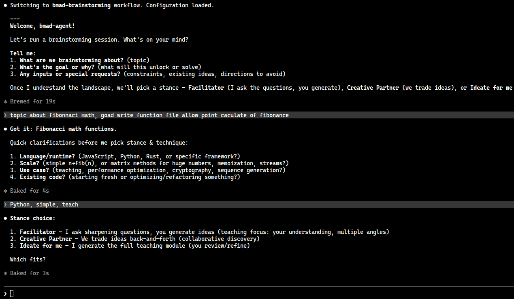

Note: trong phase này không nhất thiết yêu cầu bạn phải thực hiện.

### Bước 5: Plan Phase, thực hiện lên kế hoạch

Khi chuyển sang chế độ Phase Plan bạn sẽ có 3 lựa chọn

Nếu bạn sử dụng Quick Flow, thực hiện thông qua lệnh
```bash
/bmad-quick-dev
```

BMAD sẽ gộp cả planning và implementation trong 1 lần đối với workflow này giúp bạn tiết kiệm thời gian hơn.

Nếu bạn sử dụng Enterprise, thực hiện lệnh

```bash
/bmad-agent-pm
```

[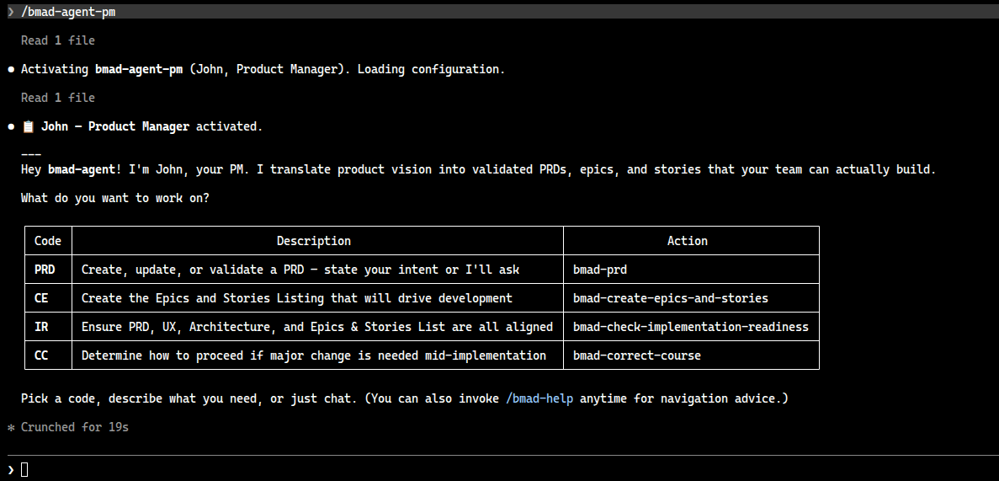

sau khi một agent mới được tạo

sử dụng lệnh

```bash
/bmad-prd
```

bạn có thêm tham khỏa thêm các câu lệnh bmad, hay như trong quấ trình planning bạn có thẻ gọi các agent khác để update

ví dụ khi cần bổ sụng UI/UX cho service
```bash
./bmad-agent-ux-designer
```

kết quả là file PRD.md sẽ được tạo ra

[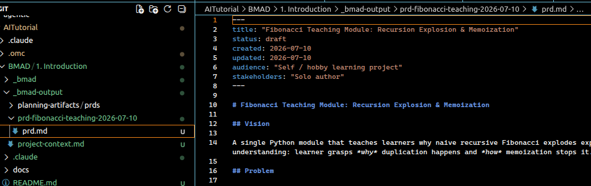

### Bước 5: Tương tự ứng với quy trình khi bạn tạo ra các task, epic và story rồi cho luồng phân thích nghiệp vụ thì tiếp đó cần phải đánh giá giải pháp xem có khả thi không ,
Phase Soution sẽ giải quyết vấn đề này

thực hiện lệnh

```bash
/bmad-agent-architect
```

hoặc phiên bản 6.x đô đi đổi tên thành

```bash
/bmad-architect
```

Tiếp đó thực hiện tạo document bằng

```bash
/bmad-create-architecture
```

[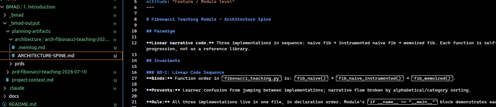

Đầu ra của phần này là 1 bản kiến trúc markdown, sau khi có kiến trúc, lúc này bạn có thể bắt đầu tạo epic và story.

