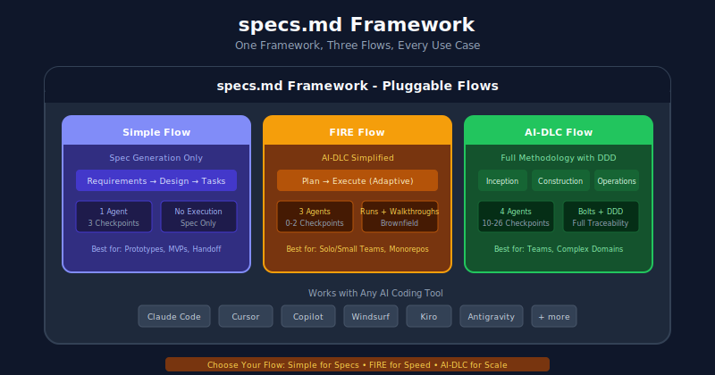

# Context

Trong phần này chúng ta sẽ đi tìm hiểu specs là gì và một số luồng quy trình sử dụng trong spec

# Specs là gì

specs.md là là một khung phát triển (development framework) thuần AI (AI-native) cung cấp các dạng quy trình linh hoạt và có thể kết nối được với các hệ thống khác nhau (flow pluggable) được sử dụng để tích hợp phát triển ứng dụng AI trong Project

đưới đây là 3 flow mà Specs đưa ra

### Simple Flow:
- Bao gồm một quy trình đơn giản dưới dạng tài liệu đặc tả (requirements, design, task)
- **Ứng dụng** Nhanh chóng tạo các tài liệu về yêu cầu (requirements), thiết kế (design) và danh sách công việc (task).
### FIRE Flow:
- Bao gồm một quy trình thích ứng. khác với simple flow, quy trình này hướng tới thực thi nhiều hơn bằng việc tự động điều
  chỉnh mức độ giới hạnh để hỗ trợ cho các dự án cũ (brownfield) và monorepo.
### AI-DLC Flow:
- Bao gồm toàn bộ quy trình phát triển sản phẩm, bao gồm cả DDD (Domain-Driven Design) và 4 nhóm agent (requirements, design, task, test)
- Quản lý toàn bộ vòng đời phát triển phần mềm với mô hình Thiết kế hướng tên miền (DDD - Domain-Driven Design) và sự phối hợp của 4 nhóm AI agent.

Dưới đây là ví dụ cấu trúc khi triển khai theo specs framework và cách thức triển khai các điều kiện trong specs framework:

specs.md (Framework)
├── Core (Standards, Agents, State)
└── Flows/
    ├── simple/     ← Spec generation only
    ├── fire/       ← Rapid execution (0-2 checkpoints)
    └── aidlc/      ← Full methodology with DDD

Dưới đây là bảng so sánh giữa các flow

| Khía cạnh (Aspect) | Đơn giản (Simple) | FIRE | AI-DLC |
| :--- | :--- | :--- | :--- |
| **Tối ưu hóa cho** *(Optimized For)* | Chỉ khởi tạo tài liệu đặc tả *(Spec generation)* | Thực thi thích ứng *(Adaptive execution)* | Khả năng truy xuất nguồn gốc toàn diện *(Full traceability)* |
| **Điểm kiểm soát** *(Checkpoints)* | 3 (các cổng giai đoạn) *(3 (phase gates))* | Thích ứng (theo độ phức tạp + cấu hình) *(Adaptive (complexity + config))* | Toàn diện *(Comprehensive)* |
| **Đặc vụ AI** *(Agents)* | 1 | 3 | 4 |
| **Theo dõi thực thi** *(Execution Tracking)* | Không *(No)* | Có *(Yes)* | Có *(Yes)* |
| **Tài liệu thiết kế** *(Design Docs)* | Cơ bản *(Basic)* | Khi độ phức tạp yêu cầu *(When complexity warrants)* | Mô hình DDD hoặc Tích hợp đơn giản *(DDD or Simple bolt)* |
| **Kho mã nguồn chung** *(Monorepo)* | Không *(No)* | Hỗ trợ tối đa *(First-class)* | Hạn chế *(Limited)* |

## References
- https://specs.md/