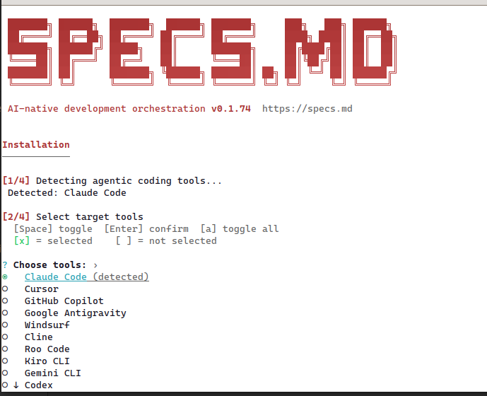
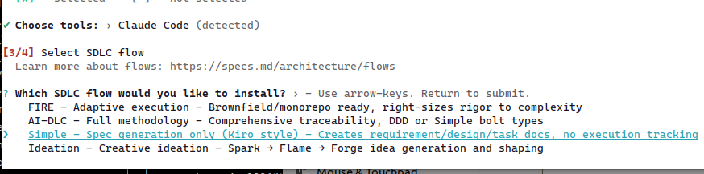
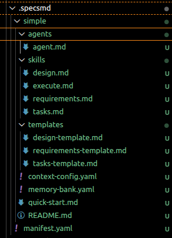
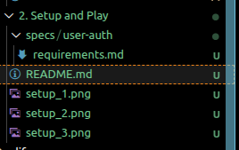

# Context

Trong phần này chúng ta sẽ cài đặt và sử dụng
note: trong hướng dẫn này sẽ sử dụng Claude để thực hiện các nhiệm vụ như tạo code, giải thích code, và cung cấp các hướng dẫn chi tiết

# Cài đặt và sử dụng

## Yêu cầu cài đặt (Prerequisites)
- Node.js > 18
- Python >= 3.9
- Claude Code cli hoặc IDE như Cursor, VSCode

## Thực hiện

### Bước một mở Terminal (Macosx, Linux) hay Powershell (Window) lên và chạy lệnh

```bash
npx specsmd@latest install
```

Sau khi chạy lệnh, ngay sau đó một cửa sổ sẽ hiện thị lên

[

Lựa chọn option tương ứng

[


Sau đó lựa chon Flow Simple cho phần này của Claude Code,\

Một folder .specsmd sẽ được tạo ra với cấu trúc cơ bản sử dụng cho Simple Workflow

[

Như vậy là bạn đã tạo cấu trúc flow để thực hiện

Tiếp theo với Simple hãy tạo thêm một folders specs để lưu tài liệu

```bash
.specsmd/
├── manifest.yaml              # Installation manifest
└── simple/                    # Simple flow
    └── agents/                # Single agent

specs/                         # Your specs will go here
└── (feature folders)
```

Note với Fire và AI-DLC cấu trúc sẽ bổ sung thêm

**Fire**
```bash
specsmd/
├── manifest.yaml              # Installation manifest
└── fire/                      # FIRE flow
    ├── agents/                # Orchestrator, Planner, Builder
    └── skills/                # Agent capabilities

.specs-fire/                   # Project artifacts
├── state.yaml                 # Central state tracking
├── standards/                 # Project standards
├── intents/                   # Intent documentation
├── runs/                      # Run logs
└── walkthroughs/              # Generated documentation
```

**AI-DLC**

```bash
.specsmd/
├── manifest.yaml              # Installation manifest
└── aidlc/                     # AI-DLC flow
    ├── agents/                # Master, Inception, Construction, Operations
    ├── skills/                # Agent capabilities
    ├── templates/             # Artifact templates
    └── memory-bank.yaml       # Memory bank schema

memory-bank/                   # Project artifacts
├── standards/                 # Project standards
├── intents/                   # Intent documentation
└── bolts/                     # Bolt tracking
```

Note: bạn có thể kiểm tra file quick-start.md để có thêm thông tin chi tiết về cách cài đặt và sử dụng SpecMD.

đối với Claude, chạy lệnh

```bash
/specsmd-agent Create a user authentication system with email login
```

Như thấy một folder sẽ được tạo ra kèm tài liệu mô tả thông tin vừa tạo qua câu lệnh



Tiếp đó follow theo các bước của SpecMD để hoàn thành các yêu cầu

Note
Đối với từng flow sẽ có cá commnad khác nhau

Simple Flow:
- /specsmd-agent
FIRE Flow:
- /specsmd-fire
- /specsmd-fire-planner
- /specsmd-fire-builder
AI-DLC Flow:
- /specsmd-master-agent
- /specsmd-inception-agent
- /specsmd-construction-agent
- /specsmd-operations-agent

Như vậy là ta đã hoàn thành phần này, để đi sâu vào từng flow hơn chúng ta sẽ nói tới trong các phần sau

## References