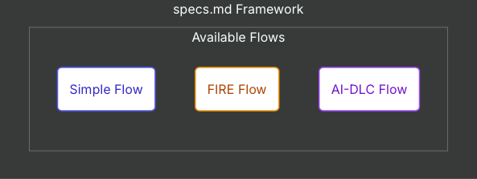

# Context

Trong phần này chúng ta sẽ đi sâu vào tìm hiểu Simple Flow và ứng dụng đối với một bài toán đơn giản để hiểu cách sử dụng hơn.

## Giới thiệu về Simple Flow 

**Simple Flow** là một quy trình phát triển dựa trên đặc tả (spec-driven) gọn nhẹ (Lightweight), dành cho các dự án không cần đến sự phức tạp toàn diện của AI-DLC. Quy trình này tương tự Kiro Spec sẽ trải qua từng bước ba giai đoạn để chuyển đổi một ý tưởng tính năng thành một kế hoạch triển khai khả thi.

3 Phase của Simple Flow 



| Giai đoạn | Đầu ra (Output) | Mục đích |
| :--- | :--- | :--- |
| **Requirements** *(Yêu cầu)* | `requirements.md` | Xác định những gì cần xây dựng bằng user stories và tiêu chí EARS |
| **Design** *(Thiết kế)* | `design.md` | Tạo thiết kế kỹ thuật với kiến trúc và biểu đồ Mermaid |
| **Tasks** *(Nhiệm vụ)* | `tasks.md` | Tạo danh sách kiểm tra (checklist) triển khai với các tác vụ lập trình cụ thể |

Cấu trúc folder của Simple Flow 

```bash
specs/
└── {feature-name}/
    ├── requirements.md    # What to build
    ├── design.md          # How to build it
    └── tasks.md           # Step-by-step plan
```

## Nguyên tắc sử dụng 

#### Khi phát triển tiếp cận theo hướng tạo trước, Hỏi sau (Generate First, Ask Later)
- AI sẽ tạo ngay một bản thảo tài liệu (requirements)) dựa trên ý tưởng, tính năng mà bạn muốn. Bản thảo này đóng vai trò là điểm khởi đầu cho cuộc thảo luận, thay vì yêu cầu bạn phải trả lời quá nhiều câu hỏi (Q&A) ngay từ đầu.

#### Phê duyệt rõ ràng theo từng chặng (Explicit Approval Gates)
- Sau bước requirements, Bạn cần phải phê duyệt rõ ràng (approve) từng giai đoạn trước khi tiếp tục. Hãy nói “yes”, “approved” hoặc “looks good” để đi tiếp. Mọi phản hồi (feedback) từ bạn đều sẽ kích hoạt quá trình chỉnh sửa lại bản thảo.
#### Tập trung giải quyết từng giai đoạn (One Phase at a Time)
- AI chỉ tập trung vào một tài liệu duy nhất trong mỗi lượt tương tác. Hãy hoàn thành dứt điểm từng giai đoạn trước khi chuyển sang giai đoạn tiếp theo.
#### Xử lý từng tác vụ (One Task at a Time)
- Trong quá trình triển khai, chỉ có một tác vụ duy nhất được thực hiện trong mỗi lượt tương tác. Điều này giúp bạn có thể kiểm tra kỹ lưỡng từng thay đổi một.

# 3 Phase của Simple Flow 


Như thấy ở phần đầu Simple Flow dựa theo SDLC đưa ra 3 phase cơ bản đối với phát triển phần mềm.

#### Phase 1: Requirements

Trong phase này, mọi người sẽ dựa trên ý tưởng hay một business case để bắt đầu đưa ra những idea thông qua thu thập từ biz user để break ra các user story và các tiêu chỉ chấp thuận (acceptance criteria)
