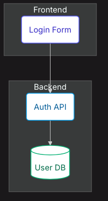

# Context

Trong phần này chúng ta sẽ đi sâu vào tìm hiểu Simple Flow và ứng dụng đối với một bài toán đơn giản để hiểu cách sử dụng hơn.

## Giới thiệu về Simple Flow

**Simple Flow** là một quy trình phát triển dựa trên đặc tả (spec-driven) gọn nhẹ (Lightweight), dành cho các dự án không cần đến sự phức tạp toàn diện của AI-DLC. Quy trình này tương tự Kiro Spec sẽ trải qua từng bước ba giai đoạn để chuyển đổi một ý tưởng tính năng thành một kế hoạch triển khai khả thi.

3 Phase của Simple Flow


| Giai đoạn | Đầu ra (Output) | Mục đích |
| :--- | :--- | :--- |
| **Requirements** *(Yêu cầu)* | `requirements.md` | Xác định những gì cần xây dựng bằng user stories và tiêu chí EARS |
| **Design** *(Thiết kế)* | `design.md` | Tạo thiết kế kỹ thuật với kiến trúc và biểu đồ Mermaid |
| **Tasks** *(Nhiệm vụ)* | `tasks.md` | Tạo danh sách kiểm tra (checklist) triển khai với các tác vụ lập trình cụ thể |

Cấu trúc folder của Simple Flow

```bash
specs/
└── {feature-name}/
    ├── requirements.md    # What to build
    ├── design.md          # How to build it
    └── tasks.md           # Step-by-step plan
```

## Nguyên tắc sử dụng

#### Khi phát triển tiếp cận theo hướng tạo trước, Hỏi sau (Generate First, Ask Later)
- AI sẽ tạo ngay một bản thảo tài liệu (requirements)) dựa trên ý tưởng, tính năng mà bạn muốn. Bản thảo này đóng vai trò là điểm khởi đầu cho cuộc thảo luận, thay vì yêu cầu bạn phải trả lời quá nhiều câu hỏi (Q&A) ngay từ đầu.

#### Phê duyệt rõ ràng theo từng chặng (Explicit Approval Gates)
- Sau bước requirements, Bạn cần phải phê duyệt rõ ràng (approve) từng giai đoạn trước khi tiếp tục. Hãy nói “yes”, “approved” hoặc “looks good” để đi tiếp. Mọi phản hồi (feedback) từ bạn đều sẽ kích hoạt quá trình chỉnh sửa lại bản thảo.
#### Tập trung giải quyết từng giai đoạn (One Phase at a Time)
- AI chỉ tập trung vào một tài liệu duy nhất trong mỗi lượt tương tác. Hãy hoàn thành dứt điểm từng giai đoạn trước khi chuyển sang giai đoạn tiếp theo.
#### Xử lý từng tác vụ (One Task at a Time)
- Trong quá trình triển khai, chỉ có một tác vụ duy nhất được thực hiện trong mỗi lượt tương tác. Điều này giúp bạn có thể kiểm tra kỹ lưỡng từng thay đổi một.

# 3 Phase của Simple Flow


Như thấy ở phần đầu Simple Flow dựa theo SDLC đưa ra 3 phase cơ bản đối với phát triển phần mềm.

#### Phase 1: Requirements

Trong phase này, mọi người sẽ dựa trên ý tưởng hay một business case để bắt đầu đưa ra những idea thông qua thu thập từ biz user để break ra các user story và các tiêu chỉ chấp thuận (acceptance criteria). Thông thường phase này sẽ đừng từ góc độ view Biz (Bussiness Architecture) với sự tham gia của Business Owner, Product Owner * UX/UI và Business analytic để brain storming đưa ra.

thông thường đàu ra là một file requirements với cấu trúc

```bash
specs/{feature}/requirements.md
```

Trong file này tùy thuộc tính năng, nhưng thông thường mô tả

- Giới thiệu (Introduction): Tóm tắt tính năng từ 2 đến 3 câu.
- Thuật ngữ (Glossary): Các thuật ngữ chuyên ngành được sử dụng nhất quán xuyên suốt tài liệu.
- Yêu cầu (Requirements): Các user stories đi kèm với tiêu chỉ chấp thuận (acceptance criteria) theo cấu trúc đinh dạng EARS.

Note: định dạng EARS (EARS Format) hay Easy Approach to Requirements Syntax là cách tiếp cận đơn giản trong đó:

### Định dạng EARS (EARS Format)

| Dạng yêu cầu (Pattern) | Định dạng (Format) | Ví dụ (Example) |
| :--- | :--- | :--- |
| **Kích hoạt bằng sự kiện**<br>*(Event-driven)* | **KHI** [kích hoạt], **THÌ [hệ thống] SẼ** [phản hồi]<br>*(WHEN [trigger], THE [system] SHALL [response])* | **KHI** người dùng gửi thông tin đăng nhập, **THÌ** Hệ_thống_Xác_thực **SẼ** kiểm tra thông tin tài khoản. |
| **Dựa trên trạng thái**<br>*(State-driven)* | **TRONG KHI** [điều kiện], **THÌ [hệ thống] SẼ** [phản hồi]<br>*(WHILE [condition], THE [system] SHALL [response])* | **TRONG KHI** phiên làm việc còn hoạt động, **THÌ** Hệ_thống_Xác_thực **SẼ** làm mới mã token. |
| **Tình huống ngoài ý muốn**<br>*(Unwanted / Error)* | **NẾU** [điều kiện lỗi], **THÌ [hệ thống] SẼ** [phản hồi]<br>*(IF [condition], THEN THE [system] SHALL [response])* | **NẾU** mật khẩu không hợp lệ, **THÌ** Hệ_thống_Xác_thực **SẼ** hiển thị thông báo lỗi. |
| **Tùy chọn / Không bắt buộc**<br>*(Optional)* | **TRONG TRƯỜNG HỢP** [tùy chọn], **THÌ [hệ thống] SẼ** [phản hồi]<br>*(WHERE [option], THE [system] SHALL [response])* | **TRONG TRƯỜNG HỢP** tính năng MFA được bật, **THÌ** Hệ_thống_Xác_thực **SẼ** yêu cầu thêm yếu tố xác thực thứ hai. |

Example

```
## Requirements

### Requirement

**User Story:** As a user, I want to log in with my email and password,
so that I can access my account.

#### Acceptance Criteria

1. WHEN user submits valid credentials, THE Auth_System SHALL create a session
2. IF password is invalid, THEN THE Auth_System SHALL display error message
3. WHILE session is active, THE Auth_System SHALL maintain authentication state
```

#### Phase 2: Design

Đây là phase sẽ mang hướng thuần góc nhìn Technical/Software Architecture.

Đàu ra là một file design với cấu trúc

```bash
specs/{feature}/design.md
```

Trong file này sẽ bao gồm các nội dung:
- Tổng quan (Overview) - Cách tiếp cận giải pháp và các quyết định cốt lõi
- Kiến trúc (Architecture) - Biểu đồ Mermaid hiển thị cấu trúc hệ thống
- Thành phần (Components) - Các giao diện (interfaces) và vai trò/nhiệm vụ
- Mô hình dữ liệu (Data Models) - Các interface TypeScript kèm theo quy tắc xác thực (validation)
- Xử lý lỗi (Error Handling) - Các loại lỗi và chiến lược khôi phục/xử lý lỗi
- Chiến lược kiểm thử (Testing Strategy) - Các danh mục kiểm thử và mức độ bao phủ (coverage)

Về mặt technical phần lớn content trong file này sẽ được mô tả dưới dạng biểu đồ sử dụng công cụ mermaid đẻ visualization 
Ví dụ 



Về Data architecture sẽ thể hiện design model tương tự sử dụng db diagram

```bash
interface User {
  id: string;           // UUID, required
  email: string;        // Valid email format
  passwordHash: string; // Bcrypt hash
  createdAt: Date;
  lastLogin?: Date;
}
```

#### Phase 3: Tasks

Trong bất kỳ giai đoạn của kiến trúc nào sau khi đã chốt giải pháp thì khâu lên kế hoạch và break thành các công việc cụ thể.

Kết quả đầu ra của phase này là 1 file 
```bash
specs/{feature}/tasks.md
```

Bao gồm nội dung:

* **Danh sách công việc (Numbered checkbox list)** - Các bước lập trình tăng tiến (incremental steps)
* **Tham chiếu yêu cầu (Requirement references)** - Khả năng truy xuất nguồn gốc nguồn gốc đối với các yêu cầu ban đầu (traceability)
* **Tác vụ kiểm tra (Checkpoint tasks)** - Các điểm xác thực và nghiệm thu (chạy kiểm thử - run tests)

Ví dụ 
```bash
## Tasks

- [ ] 1. Set up authentication module structure
  _Requirements: 1.1_

- [ ] 2. Implement user data model
  - [ ] 2.1 Create User interface
  - [ ] 2.2 Add validation rules
  - [ ] 2.3 Write unit tests
  _Requirements: 1.2, 1.3_

- [ ] 3. Checkpoint - Verify all tests pass

- [ ] 4. Implement login endpoint
  _Requirements: 1.1, 1.4_
```

Trong trường hợp cần mô tả kỹ hơn bạn có thể sử dụng các quy tắc (rules) cụ thể hơn 

| Quy tắc (Rule) | Mô tả (Description) |
| :--- | :--- |
| **Chỉ tác vụ lập trình** <br>*(Coding tasks only)* | Không bao gồm triển khai (deployment), viết tài liệu, hoặc kiểm thử thủ công (manual testing) |
| **Tăng tiến** <br>*(Incremental)* | Mỗi tác vụ đều được xây dựng tiếp nối dựa trên các tác vụ trước đó |
| **Điểm kiểm tra** <br>*(Checkpoints)* | Chạy các bài kiểm thử (tests) sau mỗi 2 đến 3 tác vụ |
| **Khả năng truy vết** <br>*(Traceability)* | Tham chiếu đến các yêu cầu ban đầu bằng cú pháp `_Requirements: X.Y_` |
| **Tối đa 2 cấp độ** <br>*(Max 2 levels)* | Chỉ bao gồm cấp cao nhất (1, 2, 3) và các tác vụ con (2.1, 2.2) |

Sau khi kết thúc 3 phase, agent sẽ hỏi bạn chuyển sang giai đoạn thực thi.
Tuy nhiên 1 lưu ý, thực tiễn đôi khi bạn sẽ cần phải chuyển về task trước đó bạn có thể sử dụng lệnh gửi cho agent để thực hiện lại, và sẽ bắt đầu lại từ quy trình trước đó.

| Trạng thái hiện tại <br>*(Current)* | Tình huống kích hoạt <br>*(Trigger)* | Hành động <br>*(Action)* |
| :--- | :--- | :--- |
| **Design** *(Thiết kế)* | Yêu cầu bị mơ hồ <br>*(Requirement ambiguous)* | ”Should we update requirements?” <br>*(Chúng ta có nên cập nhật tài liệu yêu cầu không?)* |
| **Tasks** *(Nhiệm vụ)* | Phát hiện lỗ hổng thiết kế <br>*(Design gap found)* | ”Should we update design?” <br>*(Chúng ta có nên cập nhật bản thiết kế không?)* |
| **Execute** *(Triển khai)* | Tác vụ bị chặn/nghẽn <br>*(Task blocked)* | ”Should we add a task?” <br>*(Chúng ta có nên thêm một tác vụ mới không?)* |

