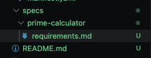
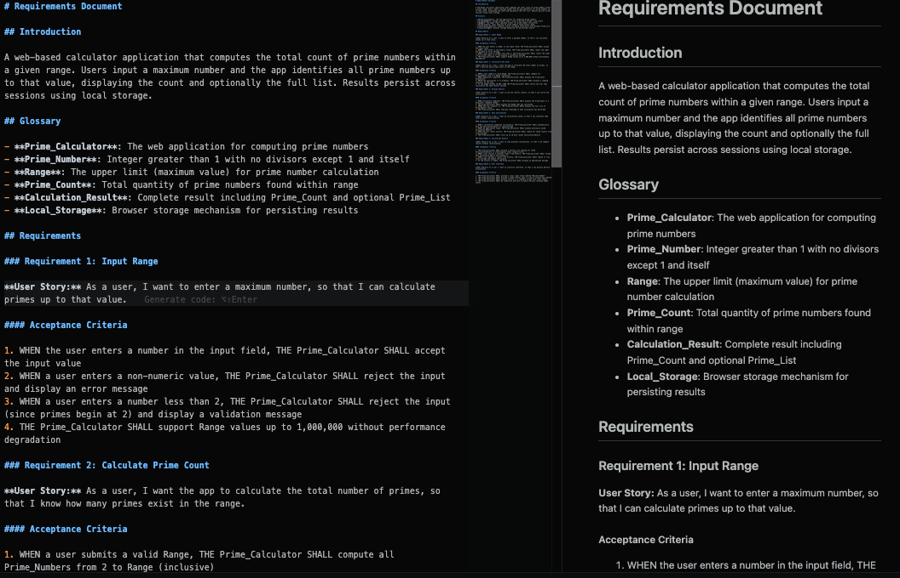
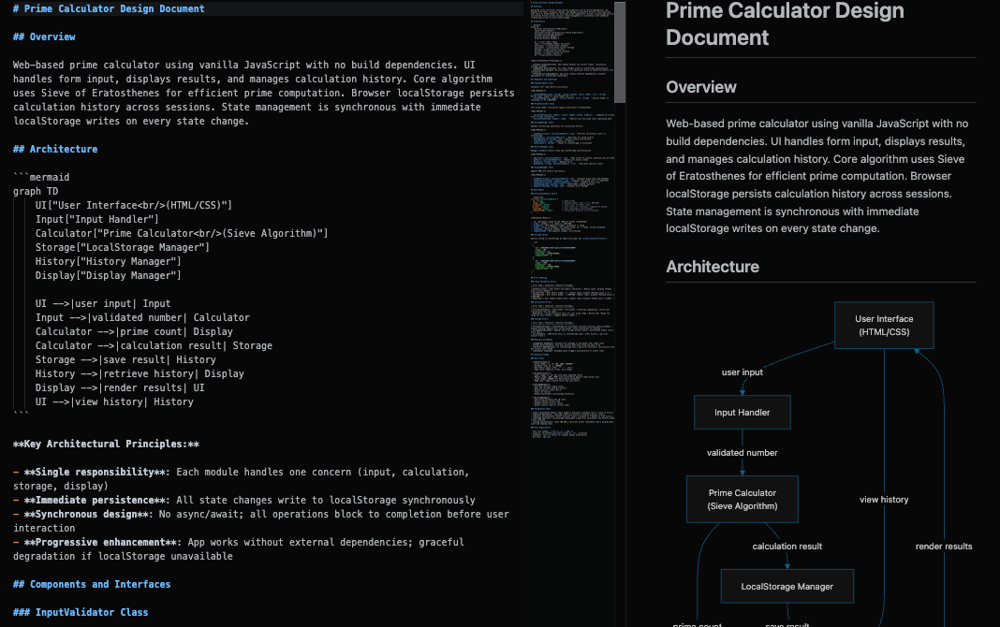
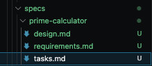
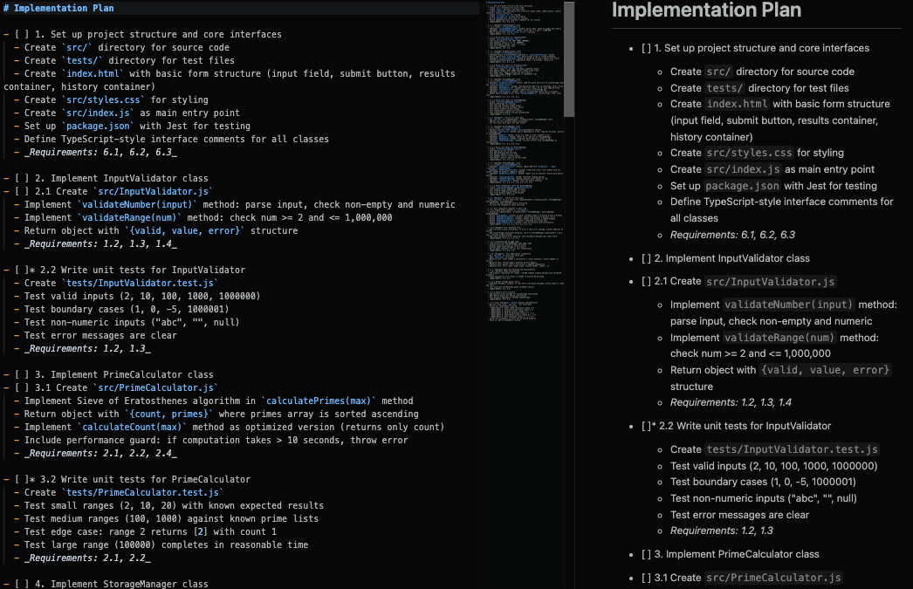
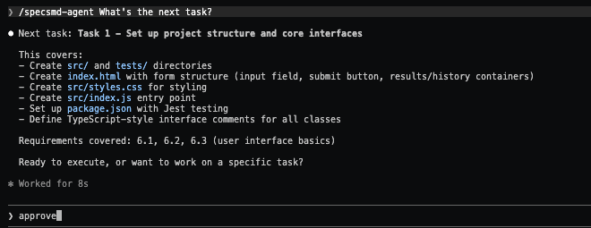

# Context

Trong phần này chúng ta sẽ đi vaof thực hiện tạo một project với cấu trúc simple flow với dạng bài tính tổng các số nguyên số tố.

# Cài đặt và sử dụng

## Yêu cầu cài đặt (Prerequisites)
- Node.js > 18
- Python >= 3.9
- Claude Code cli hoặc IDE như Cursor, VSCode

## Thực hiện

Bước 1: Mở Console/Terminal lên và gõ lệnh và chọn Simple Flow 

```bash
npx specsmd@latest install
```

Bước 2: Mở CLI hay IDE lê và thưc hiện lệnh tạo agent 

```bash
 /specsmd-agent Create a Calculate app the total number of prime numbers  with local storage
```

Note: Phần này bạn cần mô tả thêm chi tiết về ngôn ngữ và cách thức triển khai để agent hiểu và generate ra, default agent thường sẽ lựa chọn nodejs hay python.

Folder specs sẽ được tạo ra bạn đầu vơi file requirements, lúc này hãy review và mô tả ý định mong muốn 




Bước 3: Đánh giá kiểm tra nội dung file Requirements.md được generate ra và sửa lại nếu chưa hợp lý (Bạn có thể ngồi cùng mọi nguồi trong team để brain storming ở giai đoạn này )



Sau khi review đánh giá, để tiếp tục hay gõ approved hay yes 
Trường hợp bạn muốn quay trở lại, hãy xác định requirements và đưa lại thông tin cho agent 

Khi chuyển sang phase toeeps theo, file design sẽ được tạo ra 

Bước 4: Tiếp tục sang phase thiết kế, phần này sẽ mô tả kiến trúc phần mềm từ khâu design kiến trúc overview tới database desgin và workflow với mermaid 



Tượng tự Bước 3 đánh giá chỉnh sửa nếu có sự thay đổi sau đố approve/yes để chuyển sang planning break công việc thanh các task.




Bước 5: Giai đoạn Task mô tả cách thực hiện 



Sau khi hoàn tuần ta có thể chuyển sang giai đoạn thực thi với 
trường hợp resume lại session, bạn có thể hỏi lại agent bằng lệnh 

```bash
/specsmd-agent What's the next task?
```



Khi approved agent sẽ tiến hành generate code theo kịch bản ra sản phẩm hoàn chỉnh

Note: Trong quá trình define và thực thi, Simple Flow cũng cung cấp chi tiết một số command đẻ ngừi dùng có thể tạo mới hay chỉnh sửa và thực thi lại đặc tả và design 

| Action | Command | Purpose (Mục đích) |
| :--- | :--- | :--- |
| Create new spec | `/specsmd-agent Create a [feature idea]` | Tạo một đặc tả mới cho ý tưởng tính năng |
| Continue existing | `/specsmd-agent` | Tiếp tục quy trình đang dang dở |
| Resume specific spec | `/specsmd-agent --spec="todo-app"` | Tiếp tục một đặc tả cụ thể (Ví dụ: "todo-app") |
| Ask what’s next | `/specsmd-agent What's the next task?` | Hỏi xem tác vụ tiếp theo cần làm là gì |
| Execute specific task | `/specsmd-agent Execute task 2.1` | Thực thi một tác vụ cụ thể (Ví dụ: tác vụ 2.1) |


# References