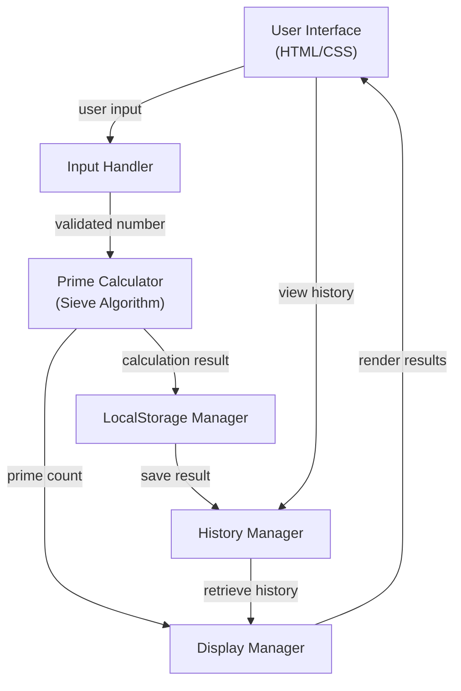

# Prime Calculator Design Document

## Overview

Web-based prime calculator using vanilla JavaScript with no build dependencies. UI handles form input, displays results, and manages calculation history. Core algorithm uses Sieve of Eratosthenes for efficient prime computation. Browser localStorage persists calculation history across sessions. State management is synchronous with immediate localStorage writes on every state change.

## Architecture



**Key Architectural Principles:**

- **Single responsibility**: Each module handles one concern (input, calculation, storage, display)
- **Immediate persistence**: All state changes write to localStorage synchronously
- **Synchronous design**: No async/await; all operations block to completion before user interaction
- **Progressive enhancement**: App works without external dependencies; graceful degradation if localStorage unavailable

## Components and Interfaces

### InputValidator Class

Validates user input before calculation.

**Key Methods:**

- `validateNumber(input: string): {valid: boolean, value: number, error: string}` - Parses input, checks if valid number and >= 2
- `validateRange(num: number): {valid: boolean, error: string}` - Ensures number is reasonable (2 to 1,000,000)

### PrimeCalculator Class

Core prime number calculation engine using Sieve of Eratosthenes.

**Key Methods:**

- `calculatePrimes(max: number): {count: number, primes: number[]}` - Computes all primes from 2 to max (inclusive)
- `calculateCount(max: number): number` - Returns only the prime count (optimized path)

### StorageManager Class

Handles localStorage operations for calculation history.

**Key Methods:**

- `saveResult(result: CalculationResult): void` - Persists calculation result to localStorage
- `getHistory(): CalculationResult[]` - Retrieves all saved results
- `deleteResult(id: string): void` - Removes result from history
- `clearHistory(): void` - Deletes all results
- `isAvailable(): boolean` - Checks if localStorage is accessible

### HistoryManager Class

Manages in-memory history state and localStorage synchronization.

**Key Methods:**

- `add(result: CalculationResult): void` - Adds result to history, maintains max 10 items
- `getAll(): CalculationResult[]` - Returns all history items
- `delete(id: string): void` - Removes by id
- `getById(id: string): CalculationResult | null` - Retrieves specific result

### DisplayManager Class

Updates DOM with results and history.

**Key Methods:**

- `showResult(result: CalculationResult): void` - Displays prime count and metadata
- `showPrimeList(primes: number[]): void` - Displays full prime list (if requested)
- `showHistory(results: CalculationResult[]): void` - Renders history list
- `showLoading(show: boolean): void` - Shows/hides loading indicator
- `showError(message: string): void` - Displays error message

## Data Models

### CalculationResult Entity

```typescript
interface CalculationResult {
  id: string;                    // UUID format
  range: number;                 // Maximum number input (2 to 1,000,000)
  primeCount: number;            // Total count of primes found
  primes?: number[];             // Full prime list (optional, computed on demand)
  timestamp: number;             // Unix timestamp in milliseconds
  computeTimeMs: number;         // Calculation duration in milliseconds
}
```

**Validation Rules:**

- `id`: Non-empty unique string (UUID v4 format recommended)
- `range`: Integer, 2 <= range <= 1,000,000
- `primeCount`: Non-negative integer, primeCount <= range
- `primes`: Array of integers, all values prime, all <= range, sorted ascending
- `timestamp`: Positive integer (Date.now())
- `computeTimeMs`: Non-negative integer, milliseconds

### Storage Format

Results stored in localStorage as JSON array under key `prime-calculator-history`:

```json
[
  {
    "id": "550e8400-e29b-41d4-a716-446655440000",
    "range": 100,
    "primeCount": 25,
    "timestamp": 1704067200000,
    "computeTimeMs": 5
  },
  {
    "id": "550e8400-e29b-41d4-a716-446655440001",
    "range": 1000,
    "primeCount": 168,
    "timestamp": 1704067260000,
    "computeTimeMs": 18
  }
]
```

## Error Handling

### Input Validation Errors

| Error Type | Condition | Recovery Strategy |
|------------|-----------|-------------------|
| NonNumericInput | User enters non-numeric characters | Reject input, display "Please enter a valid number" |
| BelowMinimum | User enters number < 2 | Reject input, display "Minimum value is 2" |
| AboveMaximum | User enters number > 1,000,000 | Reject input, display "Maximum value is 1,000,000" |
| EmptyInput | User submits empty field | Reject input, display "Please enter a number" |

### Calculation Errors

| Error Type | Condition | Recovery Strategy |
|------------|-----------|-------------------|
| CalculationTimeout | Sieve takes > 10 seconds | Interrupt computation, notify user "Calculation took too long" |
| MemoryError | Array allocation fails for very large range | Notify user "Range too large for this browser", suggest smaller number |

### Storage Errors

| Error Type | Condition | Recovery Strategy |
|------------|-----------|-------------------|
| StorageUnavailable | localStorage not accessible (private browsing, quota exceeded) | Display warning "Results will not be saved", allow calculation to continue |
| StorageQuotaExceeded | Adding result exceeds browser quota | Auto-delete oldest result, retry save |
| CorruptedData | JSON parse fails on localStorage read | Clear history, log error, restart fresh |

### Recovery Strategies

- **Immediate Feedback**: Display error message in red banner near input field
- **Clear Instructions**: Tell user exactly what went wrong and what to do
- **Graceful Degradation**: If localStorage fails, app still functions; calculations work but history isn't saved
- **Automatic Cleanup**: Exceeded quota triggers auto-deletion of oldest items

## Testing Strategy

### Unit Tests

- **InputValidator**:
  - Valid numbers (2, 10, 100, 1000, 1000000)
  - Boundary cases (0, 1, 1000001)
  - Non-numeric input ("abc", "", " ", null)
  - Edge cases (negative, float, very large)

- **PrimeCalculator**:
  - Small ranges (2, 10, 20) with known expected counts
  - Medium ranges (100, 1000) with verification against known prime lists
  - Large ranges (100000) for performance validation
  - Edge case: range 2 should return [2] with count 1

- **StorageManager**:
  - Save and retrieve single result
  - Save and retrieve multiple results
  - Delete specific result by id
  - Clear all results
  - Handle unavailable localStorage gracefully

- **HistoryManager**:
  - Add result maintains max 10 items
  - Delete removes correct item
  - GetById returns correct result
  - GetAll returns items in correct order

### Integration Tests

- **Full Calculation Flow**: Input number → Calculate → Display result → Save to history
- **History Retrieval**: Load app → Retrieve history → Display previous results
- **History Interaction**: Select previous result → Display it → Delete it from history
- **Storage Failure**: localStorage unavailable → App still calculates → No history saved → User notified
- **Large Calculation**: Input 100,000 → Calculate within reasonable time → Display both count and loading state

### Test Organization

- Test file naming: `*.test.js` or `*.spec.js`
- Location: Co-located with source files in `src/` directory
- Framework: Jest (or Vitest for lighter weight alternative)
- Run with: `npm test`
