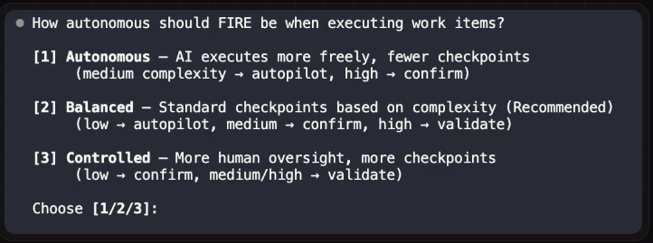
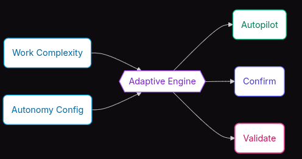
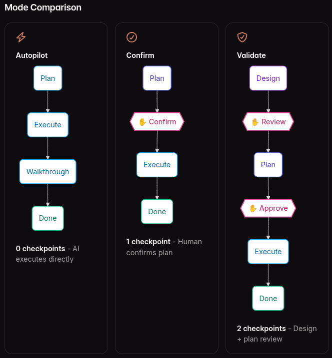
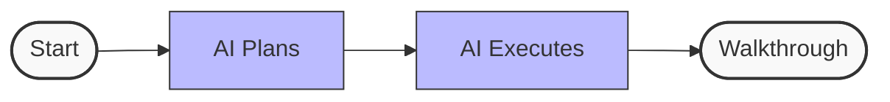
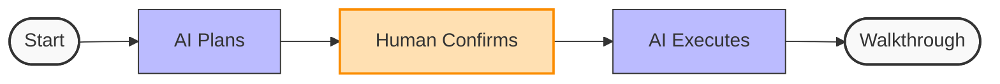

# Context

Trong phần này chúng ta sẽ đi sâu hơn và các chế độ thực thi của FIRE Flow.

# Thực thi Thích ứng (Adaptive Execution)

Như phần trước chúng ta đã tìm hiểu, FIRE là một quy trình triển khai thích ứng nhằm giúp giải quyết một dự án đã
bắt đầu trước đó hay trong một dự án monorepo. Tuy nhiên vậy làm cách nào để FIRE Flow thực hiện mà ko bắt đầu từ nhưng
Phase như Simple Flow.

Thực tế FIRE Flow khi thực thi sẽ tự động điều chỉnh theo cách thức thích ứng, điều này được thực hiện dựa trên hai dữ liệu đầu vào
- Độ phức tạp của công việc (Work Complexity): Đây là một chỉnh sửa nhỏ (tweak) hay là một thay đổi mang tính hệ thống, tùy thuộc vào mức độ mà xếp loại Low, Medium, High
- Cấu hình của bạn (Your Autonomy Config): Bạn muốn mức độ giám sát là bao nhiêu khi khởi tạo dự án ?

Hai yếu tố này kết hợp với nhau để linh hoạt lựa chọn khi nào cần hỏi ý kiến bạn và khi nào nên tự động chạy:

| Chế độ (Mode) | Điểm kiểm soát (Checkpoints) | Trường hợp sử dụng (Use For) |
| :--- | :--- | :--- |
| **Tự động hoàn toàn (Autopilot)** | 0 | Sửa lỗi (bug), cập nhật nhỏ, các thay đổi đã được định nghĩa rõ ràng |
| **Xác nhận (Confirm)** | 1 (kế hoạch / plan) | Tính năng tiêu chuẩn, độ phức tạp trung bình |
| **Phê duyệt (Validate)** | 2 (thiết kế + kế hoạch / design + plan) | Bảo mật, thanh toán, kiến trúc cốt lõi |

ví dụ khi thực hiện







Để giải thích chi tiết hơn ta đi vào từng phần của chế độ thực thi

### Autopilot Mode (0 Checkpoints)

Ở chế độ này Agent sẽ tự động thực trực tiếp và tạo ra một flow hướng dẫn (walkthrough) để người xem đánh giá.

Note: theo khuyến cáo (recommend) chế này này dùng khi
* **Sửa lỗi (Bug fixes)** khi đã có các bước tái hiện (reproduction steps) rõ ràng
* **Cập nhật nhỏ** (thay đổi văn bản, chỉnh sửa cấu hình / config tweaks)
* **Các thao tác CRUD** đã được định nghĩa rõ ràng
* **Bổ sung test** cho mã nguồn (code) hiện tại
* **Cập nhật tài liệu (Documentation)**

Flow của Chế độ này



Trong luồng này thì agent sẽ thực hiện và không có điểm kiểm soát của con người (human checkpoints). Agent sẽ tự nạp ngữ cảnh (context), trực tiếp thực thi các thay đổi, và tạo một bản hướng dẫn chi tiết (walkthrough) để copn người xem xét lại sau đó (post-review).

Ví dụ

```txt
Work Item: Fix typo in error message
Mode: Autopilot

Builder executing...
✓ Updated src/errors.ts line 42
✓ Walkthrough generated

---
# Walkthrough: fix-error-typo

## Summary
Fixed typo "recieved" → "received" in authentication error message.

## Files Changed
- src/errors.ts (1 line)

## Verification
Error message now displays correctly on failed login.
```

### Confirm Mode (1 Checkpoint)

Khác với chế độ tự động trên, trong chế độ này Agent sẽ đưa ra plan, sau đố con người sẽ review đánh giá và đưa cho Agent thực thi



Note: theo khuyến cáo (recommend) chế độ này dùng khi
* **Triển khai các tính năng tiêu chuẩn** (Standard feature implementation)
* **Tạo các điểm cuối API** (API endpoint creation)
* **Phát triển Component** (Component development)
* **Truy vấn cơ sở dữ liệu** mà không thay đổi schema database (Database queries non-schema)
* **Tích hợp với các dịch vụ bên ngoài** (Integration with external services)

Note: 1 point ở đấy nhấn mạnh tới 1 điểm kiểm soát, con người xem xét kế hoạch của Agent trước khi thực thi. Hãy từ chối (Reject) nếu muốn cung cấp ý kiến phản hồi và nhận lại một kế hoạch đã được sửa đổi.

Ví dụ

```
Work Item: Add user profile endpoint
Mode: Confirm

---
## Plan

1. Create GET /api/users/:id endpoint
2. Add UserProfile response schema
3. Implement authorization check (user can only view own profile)
4. Add unit tests for endpoint
5. Update API documentation

**Estimated changes**: 4 files, ~80 lines

[Confirm to proceed? y/n]
```

### Validate Mode (2 Checkpoints)

Cuối cùng đây là chế độ nghiêm ngặt nhất, Agent sẽ sinh ra bản tài liệu thiết kế sau đó con người sẽ đánh giá bản thiết kế và đánh giá xem có đáp ứng được yêu cầu hay không.

```mermaid
graph LR
    Start([Start]) --> AI_Designs[AI Designs]
    AI_Designs --> Human_Reviews[Human Reviews]
    Human_Reviews --> AI_Plans[AI Plans]
    AI_Plans --> Human_Approves[Human Approves]
    Human_Approves --> AI_Executes[AI Executes]
    AI_Executes --> Walkthrough([Walkthrough])

    %% Style adjustments
    style Start fill:#f9f9f9,stroke:#333,stroke-width:2px
    style AI_Designs fill:#bbf,stroke:#333,stroke-width:1px
    style Human_Reviews fill:#ffe0b2,stroke:#fb8c00,stroke-width:2px
    style AI_Plans fill:#bbf,stroke:#333,stroke-width:1px
    style Human_Approves fill:#ffe0b2,stroke:#fb8c00,stroke-width:2px
    style AI_Executes fill:#bbf,stroke:#333,stroke-width:1px
    style Walkthrough fill:#f9f9f9,stroke:#333,stroke-width:2px
```



Note: theo khuyến cáo (recommend) chế độ này dùng khi
* **Các tính năng nhạy cảm về bảo mật** (Xác thực / auth, phân quyền / permissions)
* **Logic thanh toán và hóa đơn** (Payment and billing logic)
* **Các thay đổi đối với kiến trúc cốt lõi** (Core architecture changes)
* **Sửa đổi schema cơ sở dữ liệu** (Database schema modifications)
* **Tích hợp API bên ngoài có tác động gây ảnh hưởng tới các bên khác** (External API integrations with side effects)
* **Các tính năng ảnh hưởng đến nhiều mô đun đói với các dự án khác sử dụng chung hay riêng** (Features affecting multiple modules)

Như bạn thấy ở chế độ này có tới 2 chốt chặn để con người đánh giá. Đầu tiên là đánh giá xem bản thiết kế design okay không
nếu không có thể đặt câu hỏi để đánh giá.

Ví dụ

```
Work Item: Implement password reset flow
Mode: Validate

---
## Design Document

### Overview
Secure password reset using time-limited tokens sent via email.

### Security Considerations
- Tokens expire after 1 hour
- Tokens are single-use
- Rate limited to 3 requests per hour per email
- Token hashed in database (not stored plaintext)

### Architecture
```

User Request → Rate Limiter → Token Generator → Email Service ↓ Token Verification ← User Click ← Email ↓ Password Update → Session Invalidation

```
### Database Changes
- New table: password_reset_tokens
- Columns: id, user_id, token_hash, expires_at, used_at

[Design review complete? y/n]

---

## Implementation Plan

1. Create password_reset_tokens migration
2. Add PasswordResetService with generate/verify methods
3. Create POST /auth/forgot-password endpoint
4. Create POST /auth/reset-password endpoint
5. Add email template for reset link
6. Implement rate limiting middleware
7. Add comprehensive tests

**Estimated changes**: 8 files, ~200 lines

[Approve implementation? y/n]
```
Vì sao cần phải đánh giá dựa trên 2 giai đoạn
Để trả lời trước tiên ta cần ta cần hiểu khi Agent đưa ra phương ánh phải đánh giá xem bản đấy có phải là phương án đúng không sau khi đánh giá xong ta cần biết xem liệu nó đã đầy đủ chưa. việc làm này giúp tách biệt giữa đúng và đầy đủ riêng ra để tránh thiếu sót.

* **Bắt đầu triển khai** trên một thiết kế sai lầm/có lỗi
* **Bỏ sót các trường hợp biên** (edge cases) vốn có thể được phát hiện trong quá trình xem xét thiết kế
* **Phình to phạm vi dự án** (scope creep) trong quá trình triển khai

### Run Scope

Bên cạnh các chế độ FIRE Flow còn cung cấp thêm giới hạn phạm vi chạy (Run scope) để quyết định số lượng task được thực thi trong một lần chạy duy nhất. Điều này tách biệt với chế độ thực thi, bạn có thể gom nhóm nhiều hạng mục tự động hoàn toàn (Autopilot) lại với nhau, hoặc chạy từng hạng mục Phê duyệt (Validate) một.

### Các Tùy chọn Phạm vi (Scope Options)

*   **Đơn lẻ (Single)**
    *   Một hạng mục công việc cho mỗi lần chạy.
    *   Kiểm soát tốt nhất. Mỗi hạng mục có một lượt chạy riêng đi kèm bản hướng dẫn chi tiết (walkthrough) chuyên biệt.
    *   **Phù hợp nhất cho:** Tìm hiểu codebase (mã nguồn), các thay đổi có rủi ro cao, nhu cầu xem xét chi tiết.
*   **Gom cụm (Batch)**
    *   Nhóm theo chế độ thực thi.
    *   Tuân thủ các ràng buộc phụ thuộc. Gom các hạng mục Autopilot lại với nhau, các hạng mục Confirm lại với nhau, v.v.
    *   **Phù hợp nhất cho:** Quy trình làm việc cân bằng, công việc có độ phức tạp hỗn hợp.
*   **Mở rộng (Wide)**
    *   Số lượng hạng mục tối đa cho mỗi lần chạy.
    *   Gián đoạn tối thiểu. Tất cả các hạng mục tương thích sẽ được thực thi cùng nhau.
    *   **Phù hợp nhất cho:** Người dùng đã có kinh nghiệm, lặp lại nhanh (rapid iteration), các thay đổi đã được hiểu rõ.

### So sánh Phạm vi (Scope Comparison)

| Phạm vi (Scope) | Hạng mục mỗi lần chạy (Items per Run) | Chiến lược gom nhóm (Grouping Strategy) | Mức độ gián đoạn (Interruptions) |
| :--- | :--- | :--- | :--- |
| **Đơn lẻ (Single)** | 1 | Từng hạng mục được cô lập | Theo từng hạng mục |
| **Gom cụm (Batch)** | Theo chế độ | Nhóm theo Autopilot, Confirm, Validate | Theo từng nhóm chế độ |
| **Mở rộng (Wide)** | Tất cả các hạng mục tương thích | Gom cụm tối đa | Tối thiểu |

Ví dụ

```yaml
# state.yaml
workspace:
  run_scope_preference: batch
  run_scope_history:
    - choice: batch
      items_count: 3
      timestamp: 2024-01-15T10:30:00Z
    - choice: single
      items_count: 1
      timestamp: 2024-01-14T15:45:00Z

# References