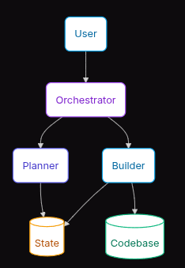
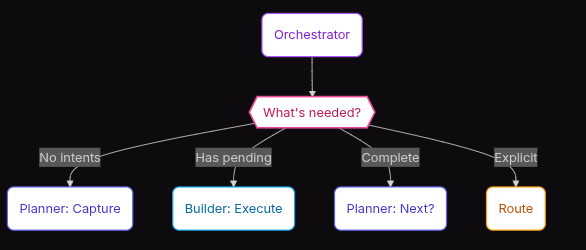
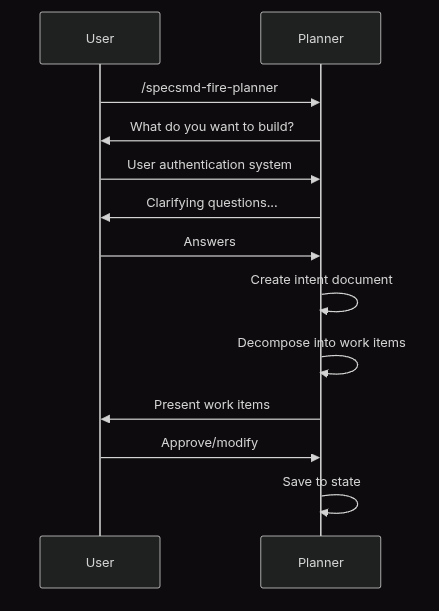
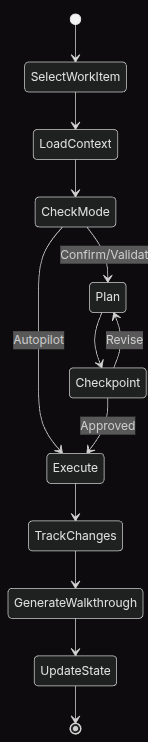
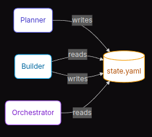

# Context

Trong phần này chúng ta sẽ đi sâu và mở rộng hơn ứng dụng agent process
FIRE Flow quy ước 3 agent Orchestrator, Planner, and Builder

# Orchestrator, Planner, và Builder Agent Architecture

FIRE Flow quy ước 3 agent này với

| Thành phần (Component) | Vai trò chính (Role) | Thông số/Cấu hình (Specs) |
| :--- | :--- | :--- |
| **AgentRoleInvocationOrchestrator** | Cổng vào (Entry point), điều hướng (routing), quản lý phiên (session management) | `md-fire` |
| **Planner** | Ghi nhận ý định (Intent capture), phân tách hạng mục công việc (work item decomposition) | `md-fire-planner` |
| **Builder** | Thực thi lượt chạy (Run execution), khởi tạo kịch bản/từng bước hướng dẫn (walkthrough generation) | `md-fire-builder` |

Sơ đồ flow mối liên hệ



Trong đố

### Điều phối (Orchestrator Agent)

Orchestrator là cổng vào (entry point) cho mọi tương tác trong hệ thống của FIRE Flow.

Nó có trách nhiệm giúp:
- Đọc file state.yaml để nắm bắt/xác định giai đoạn (phase) hiện tại.
- Đọc file config.yaml để xác định các agent phù hợp và điều hướng đến agent phù hợp dựa trên ngữ cảnh (context).
- Xử lý việc khôi phục phiên làm việc (session resume) và đảm bảo tính liên tục của quy trình.
- Đề xuất các hành động tiếp theo dựa trên trạng thái (state) hiện tại.




Cách sử dụng

```bash
/specsmd-fire

---
Reading project state...

Current State:
- Intent: User Authentication (in_progress)
- Work Items: 1/3 complete
- Next: login-endpoint (mode: Confirm)

Routing to Builder for next work item execution.
```


Session Resume

```bash
/specsmd-fire

---
Resuming previous session...

Last session ended with:
- Run 2 in progress: login-endpoint
- Status: Awaiting confirmation

Would you like to:
[c] Continue with login-endpoint
[s] Skip to next work item
[p] Return to Planner
```

### Lập kế hoạch (Planner Agent)

Planner có trách nhiệm đảm nhận toàn bộ các hoạt động lập kế hoạch trong hệ thống.

Vài trò của nó trong FIRE Flow:

- Giúp thu thập/Ghi nhận ý định (intents) của người dùng thông qua các cuộc hội thoại có định hướng.
- Phân tách các ý định lớn thành những hạng mục công việc (work items) cụ thể.
- Đánh giá độ phức tạp và chỉ định các chế độ thực thi (execution modes) phù hợp.
- Khởi tạo tài liệu thiết kế (Design documents) khi ở chế độ Xác minh (Validate mode).
- Khởi tạo và cập nhật các tiêu chuẩn/quy chuẩn của dự án (Project standards).

Trong Planner Agent cung cấp 1 số skill sẵn:

| Kỹ năng (Skill) | Mục đích (Purpose) |
| :--- | :--- |
| **intent-capture** | Dẫn dắt người dùng qua quá trình định nghĩa/xác định ý định. |
| **work-item-decompose** | Phân tách các ý định thành những hạng mục công việc (work items) có thể thực thi. |
| **design-doc-generate** | Khởi tạo tài liệu thiết kế dành riêng cho chế độ Xác minh (Validate mode). |
| **standards-init** | Khởi tạo hoặc cập nhật các tiêu chuẩn/quy chuẩn của dự án. |
| **workspace-detect** | Phân tích cấu trúc thư mục/không gian làm việc của dự án (dùng chung). |



### Thực thi (Builder Agent)

Builder Agent là nơi thực thi các công việc được phân tách từ Planner.

- Lựa chọn hạng mục công việc (work item) tiếp theo dựa trên các mối quan hệ phụ thuộc (dependencies).
- Thực thi các lượt chạy (runs) với chế độ phù hợp (Autopilot/Confirm/Validate).
- Theo dõi và ghi nhận các thay đổi của file trong quá trình thực thi.
- Khởi tạo tài liệu hướng dẫn từng bước (walkthroughs) sau khi hoàn thành công việc.
- Cập nhật trạng thái (state) thông qua các đoạn mã kịch bản (scripts).

Builder cũng cung cấp sẵn 1 số skill

| Kỹ năng (Skill) | Mục đích (Purpose) |
| :--- | :--- |
| **run-execute** | Thực thi các hạng mục công việc (work items) theo luồng xử lý riêng biệt của từng chế độ. |
| **walkthrough-generate** | Tài liệu hóa các thay đổi sau khi quá trình thực thi hoàn tất. |
| **state-management** | Cập nhật file `state.yaml` thông qua các đoạn mã kịch bản (dùng chung). |

Luồng minh họa



### Mối liên hệ giáo tiếp thông tin giữa các Agent (Agent Communication)

Bằng cách sử dụng 3 loại agent giúp cho việc ứng dụng FIRE Flow có thể tự động hóa và tối ưu hóa quá trình, tuy nhiên để giải quyết việc đồng bộ thông tin giao tiếp giữa các Agent này, FIRE Flow sử dụng file state.yaml đẻ lưu trữ context



#### Tại sao lại sử dụng lưu thông tin trạng thái dựa trên file state

* **Tính tất định (Deterministic):** Các đoạn mã kịch bản (scripts) đảm bảo việc cập nhật trạng thái luôn nhất quán và chính xác.
* **Có thể kiểm toán (Auditable):** Git sẽ theo dõi và lưu lại toàn bộ lịch sử thay đổi của trạng thái.
* **Có thể khôi phục (Resumable):** Trạng thái được lưu giữ liên tục giữa các phiên làm việc (sessions).
* **Dễ dàng gỡ lỗi (Debuggable):** Định dạng YAML giúp con người có thể dễ dàng đọc và hiểu được.

#### Danh mục Lệnh (Command Reference)

| Lệnh (Command) | Agent | Mục đích (Purpose) |
| :--- | :--- | :--- |
| `/specsmd-fire` | **Orchestrator** | Cổng vào hệ thống, điều hướng yêu cầu |
| `/specsmd-fire-planner` | **Planner** | Ghi nhận ý định người dùng, lập kế hoạch |
| `/specsmd-fire-builder` | **Builder** | Thực thi công việc, khởi tạo tài liệu hướng dẫn (walkthroughs) |