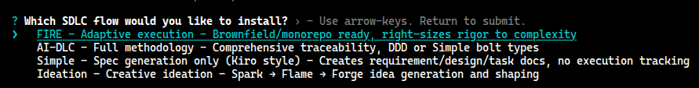
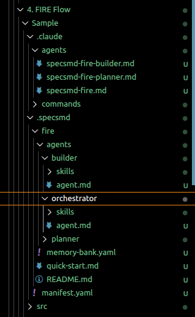
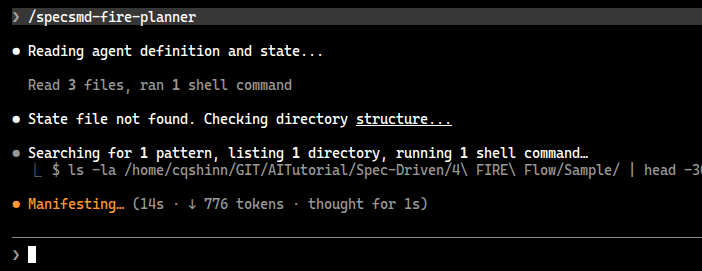
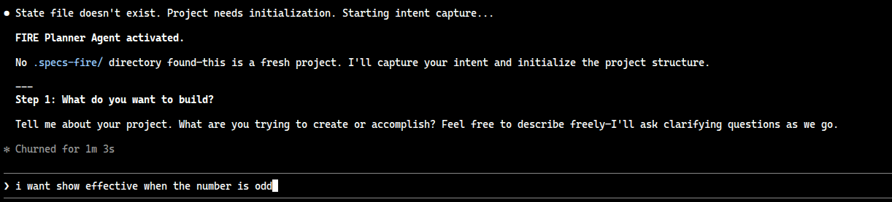
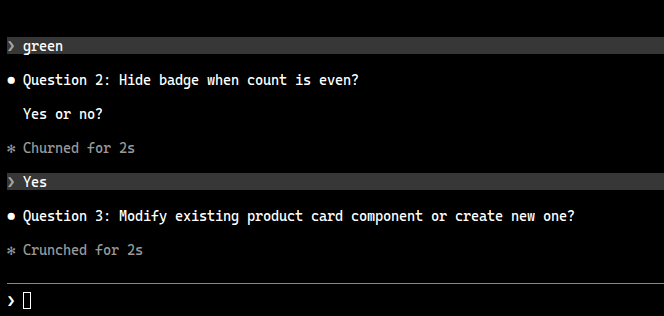
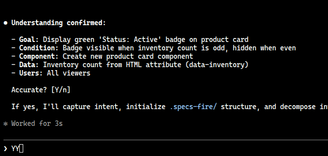
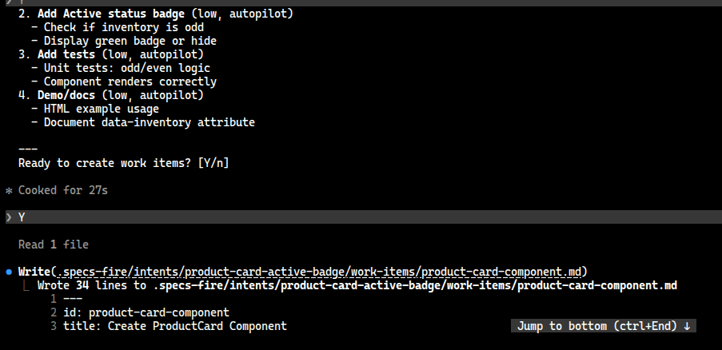
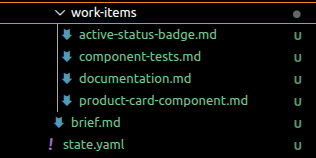
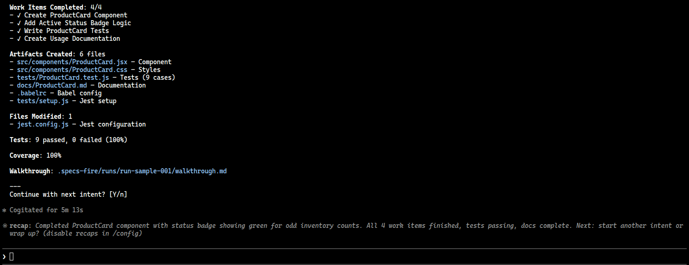
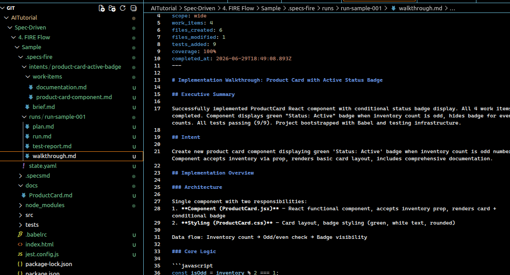

# Context

Trong phần này chúng ta sẽ đi vào thực hiện tạo một project với cấu trúc FIRE flow với dạng bài tính tổng các số nguyên số tố.

# Cài đặt và sử dụng

## Yêu cầu cài đặt (Prerequisites)
- Node.js > 18
- Python >= 3.9
- Claude Code cli hoặc IDE như Cursor, VSCode

## Thực hiện

Trước tiên cần một project đã có source code trước đó mà không cùng context, có thể sử dụng project source code trong Simple Flow nhưng clear hết dữ liệu context đi.


Ở đây chúng ta sẽ dùng project `Sample`

Bước 1: khởi tạo context cho FIRE Flow

Sau đó chúng ta chạy lệnh
```bash
npx specsmd@latest install
```

sau đó lựa chọn option FIRE



Nội dung sẽ được generate ra với 3 agent mà chúng ta đã đề cập



Bước 2: Tiếp theo, sử dụng planner để ước lượng các bước cần thực hiện

```bash
/specsmd-fire-planner
```



Trong quá trình chạy, 1 hangup sẽ hiển thị Ý đồ mà muốn (Intent)




Khi mô tả mơ hồ, hệ thống sẽ tiếp tục hỏi người dùng để cập nhật thông tin tới khi rõ ràng





Lúc này hệ thông, agent sẽ phân bổ thành các đầu công việc (Work Items), đồng thời file state.yaml cũng sẽ được cập nhật.





Bước 3: Hãy đánh giá nội dung file công việc xem ước lượng có chính xác hay không, nếu chưa chính xác, hãy sửa đổi file state.yaml và tiếp tục đánh giá.

Ví dụ state file để sắp xếp thực hiện

```yaml
project:
  name: Sample Project
  description: FIRE Flow Sample Project
  created: 2026-06-30T00:00:00Z
  fire_version: 0.1.8

workspace:
  type: greenfield
  structure: monolith
  autonomy_bias: balanced
  run_scope_preference: single
  run_scope_history: []

intents:
  - id: product-card-active-badge
    title: Product Card with Active Status Badge
    status: in_progress
    work_items:
      - id: product-card-component
        title: Create ProductCard Component
        complexity: low
        mode: autopilot # chuyển đổi trạng thái nếu cần
        status: pending
      - id: active-status-badge
        title: Add Active Status Badge Logic
        complexity: low
        mode: autopilot
        status: pending
      - id: component-tests
        title: Write ProductCard Tests
        complexity: low
        mode: autopilot
        status: pending
      - id: documentation
        title: Create Usage Documentation
        complexity: low
        mode: autopilot
        status: pending

runs:
  active: []
  completed: []
```

Bước 4: sau khi đã đánh giá triệt để, lúc này chuyển sang phần thực hiện các công việc cần thiết.

sử dụng lệnh để chuyển sang agent Builder
```yaml
/specsmd-fire-builder
```

thực hiện run, trạng thái của builder sẽ update trong state file mục run
kết quả sau khi đã chạy xong là walkthropughe các bước trên màn hình bên dưới





Như vậy là bạn đã thực hiện 1 FIRE flow với các bước đã được định nghĩa sẵn.

### Một số vấn đề gặp phải khi dùng FIRE Flow

* **Agent không nhớ ngữ cảnh:**
  Các agent hoạt động theo cơ chế không lưu trạng thái (stateless)—chúng chỉ đọc file `state.yaml` và các tạo tác (artifacts) khi khởi động. Hãy đảm bảo các file đã được lưu lại sau mỗi bước.
* **Hạng mục công việc (Work Item) bị stuck/hangup:**
  Kiểm tra file `.specs-fire/state.yaml` để xem trạng thái của hạng mục công việc. Nếu bị chặn (blocked), Builder sẽ giải thích những gì đang cần xử lý.
* **Muốn thay đổi điều chỉnh chế độ thực thi (execution mode):**
  Bạn có thể ghi đè (override) chế độ được đề xuất trong quá trình thực thi. Hãy ra lệnh: *"Override to Confirm"* (Ghi đè sang chế độ Xác nhận) hoặc *"Override to Validate"* (Ghi đè sang chế độ Xác minh).
* **Nhận diện dự án đang bị sai (Brownfield detection wrong):**
  Hãy xem lại các tiêu chuẩn được khởi tạo trong thư mục `.specs-fire/standards/` và chỉnh sửa nếu cần. Planner luôn tôn trọng các thiết lập ghi đè của bạn.
* **Có nhiều ý định trùng lặp/tồn tại (Multiple intents):**
  Chạy lệnh `/specsmd-fire` để xem toàn bộ các ý định cùng trạng thái của chúng, sau đó chỉ định rõ bạn muốn xử lý ý định nào.

---

### Các bước tiếp theo (Next Steps)

* **Chế độ thực thi (Execution Modes):** Làm chủ các chế độ Tự động (Autopilot), Xác nhận (Confirm) và Xác minh (Validate).
* **Hạng mục công việc (Work Items):** Tìm hiểu sâu hơn về cấu trúc của một hạng mục công việc.
* **Hỗ trợ Monorepo (Monorepo Support):** Các tiêu chuẩn phân cấp dành cho các dự án đa mô-đun (multi-module).
* **Các Agent trong hệ thống FIRE (FIRE Agents):** Thông tin chi tiết về Orchestrator, Planner và Builder.

# References