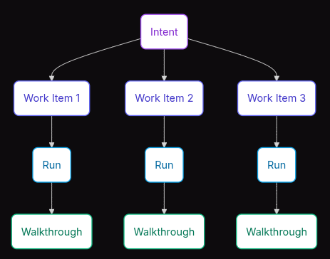
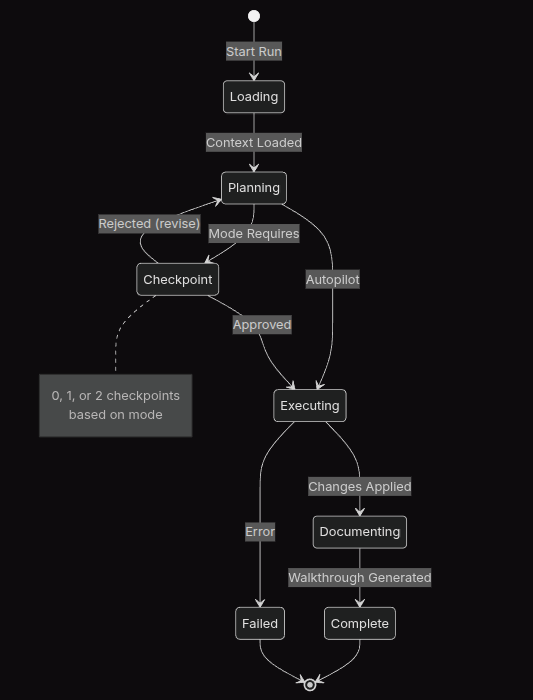

# Context

Trong phần này chúng ta sẽ đi sâu về

Như trong phần Introduction ta thấy Flow của Fire chia ra Intent - Work Item - Run - Walkthrough



Để giải thích kỹ hơn ta đi vào từng phase

### Mục đích, ý định (Intent)


Một Ý định (Intent) là một mục tiêu hướng tới việc mang lại giá trị cho người dùng. Đó chính là câu trả lời cho câu hỏi "làm cái gì" (what) và "tại sao" (why) đối với tính năng của bạn.

Ví dụ cấu trúc

```yaml
intent:
  id: auth-system
  title: User Authentication System
  description: |
    Enable users to create accounts, log in securely,
    and manage their sessions.
  status: in_progress
  priority: high
  created: 2024-01-15T10:00:00Z
```

Kết quả là một bản tài liệu mô tả được sinh ra
```bash
.specs-fire/intents/{id}/brief.md
```

```
# User Authentication System

## Objective
Enable users to create accounts, log in securely, and manage sessions.

## Context
- New greenfield project
- Expected 10k users at launch
- Must support social login in future (not MVP)

## Success Criteria
- Users can register with email/password
- Users can log in and receive session token
- Sessions expire after 24 hours
- Password reset via email works
```

Ở phần status thể hiện trạng thái, có tất cả 4 trạng thái cung cấp thông tin cụ thể của ý định đó.

| Trạng thái (State) | Mô tả (Description) |
| :--- | :--- |
| **Đang chờ (pending)** | Đã được ghi nhận nhưng chưa bắt đầu |
| **Đang thực hiện (in_progress)** | Các hạng mục công việc đang được thực thi |
| **Bị chặn (blocked)** | Đang chờ phụ thuộc vào yếu tố bên ngoài (external dependency) |
| **Hoàn thành (done)** | Tất cả các hạng mục công việc đã hoàn thành |

### Hạng mục công việc (Work Item)

Một hạng mục công việc (Work Item) là một đơn vị công việc riêng biệt để thực hiện một nhiệm vụ cụ thể. Mỗi hạng mục công việc:
* Có định nghĩa thế nào là hoàn thành (definition of done) một cách rõ ràng
* Hoàn thành trong một lượt Chạy (Run) duy nhất
* Được chỉ định độ phức tạp và chế độ thực thi (execution mode) riêng
* Có thể phụ thuộc vào các hạng mục công việc khác

Cấu trúc

```yaml
work_item:
  id: user-schema
  intent_id: auth-system
  title: Create user database schema
  description: Set up the users table with authentication fields
  complexity: low
  mode: autopilot
  depends_on: []
  status: pending
```

Kết quả là một bản tài liệu mô tả được sinh ra

```
.specs-fire/intents/{intent-id}/work-items/{id}.md
```

ví dụ về nội dung

```bash
# Create User Database Schema

## Definition of Done
- [ ] Migration file created
- [ ] User model with typed fields
- [ ] Indexes on email field
- [ ] Tests for model validation

## Technical Notes
- Use UUID for primary key
- Add soft delete support
- Email must be unique and indexed

## Dependencies
None - first work item
```

Có 2 điểm cần lưu ý

### Mức độ phức tạp (Complexity Levels)

| Cấp độ (Level) | Mô tả (Description) | Chế độ điển hình (Typical Mode) |
| :--- | :--- | :--- |
| **low** *(Thấp)* | < 50 dòng code, file đơn lẻ, định nghĩa rõ ràng | **Autopilot** *(Tự động)* |
| **medium** *(Vừa)* | 50-200 dòng code, 2-5 files, có một vài quyết định cần cân nhắc | **Confirm** *(Xác nhận)* |
| **high** *(Cao)* | 200+ dòng code, 5+ files, có ảnh hưởng đến kiến trúc hệ thống | **Validate** *(Xác thực)* |

<br>

### Trạng thái đầu việc (Work Item States)

| Trạng thái (State) | Mô tả (Description) |
| :--- | :--- |
| **pending** | Đang chờ, chưa bắt đầu |
| **in_progress** | Đang trong quá trình thực thi |
| **blocked** | Bị chặn/nghẽn (do chưa đáp ứng được điều kiện tiên quyết hoặc các phụ thuộc khác) |
| **done** | Đã hoàn thành thành công |

Note: trong quá trình triển khai đôi khi một workload item sẽ ưu tiên hơn các item khác, FIRE Flow đưa cho bạn thiết kế để đảm bảo thứ tự chạy của item thông qua cơ chế dependeny

```yaml
work_items:
  - id: user-schema
    depends_on: []

  - id: login-endpoint
    depends_on: [user-schema]  # Must complete first

  - id: session-middleware
    depends_on: [login-endpoint]
```

### Thực thi (Run)

Run là một chu kỳ thực thi đơn lẻ cho một hạng mục công việc (Work Item)). Nó có tính nguyên tử (atomic): hoặc là hoàn thành thành công, hoặc là quay lui (roll back) về trạng thái ban đầu."

dưới đây là chu trình của thực thi (Run)



Để tracking theo dõi bạn có thể tìm trong đường dẫn sau:
```bash
.specs-fire/runs/{id}.yaml
```

```yaml
run:
  id: 1
  work_item_id: user-schema
  intent_id: auth-system
  mode: autopilot
  started: 2024-01-15T10:30:00Z
  completed: 2024-01-15T10:32:00Z
  status: success
  files:
    created:
      - migrations/20240115_create_users.sql
      - src/models/user.ts
    modified:
      - src/models/index.ts
    deleted: []
  walkthrough: walkthroughs/run-fabriqa-2026-001-user-schema.md
```

Sau cùng kết quả của lượt thực thi là một file chỉ dẫn (walkthrough)

```yaml
# Run run-fabriqa-2026-001: user-schema

## Summary
Created user database schema with email/password authentication fields.

## Files Changed

### Created
- `migrations/20240115_create_users.sql`
  - Users table with id, email, password_hash, created_at, updated_at
  - Unique index on email
  - Soft delete with deleted_at column

- `src/models/user.ts`
  - User model class with TypeORM decorators
  - Password hashing on save
  - Email validation

### Modified
- `src/models/index.ts`
  - Added User export

## Key Decisions
- Used UUID for user IDs (portable across databases)
- Added soft delete for GDPR compliance
- bcrypt with cost factor 12 for password hashing

## Verification Steps
1. Run `npm run migrate` to apply schema
2. Verify table: `SELECT * FROM information_schema.tables WHERE table_name = 'users'`
3. Run tests: `npm test -- --grep "User model"`

## Test Coverage
- `tests/models/user.test.ts` - 4 tests added
  - Creates user with valid email
  - Rejects duplicate email
  - Hashes password on save
  - Supports soft delete
```

Bằng việc sử dụng walkthrough, file được sinh ra giúp cho
Lưu vết cho mọi thay đổi (Lịch sử ghi nhận đầy đủ mọi thay đổi). Dễ dàng đánh giá/review mà không cần phải đọc từng dòng code và lưu lại ngữ cảnh (context) giúp cho người tiếp nhận source có thể nắm bắt nhanh chóng.

bên cạnh đó FIRE Flow cũng sử dụng file state để lưu trữ trạng thái cụ thể

```bash
.specs-fire/state.yaml:
```

```yaml
project:
  name: my-project
  created: 2024-01-15T09:00:00Z
  framework: fire-v1

workspace:
  type: brownfield
  structure: monolith
  default_mode: confirm

intents:
  - id: auth-system
    title: User Authentication
    status: in_progress
    priority: high
    work_items:
      - id: user-schema
        status: done
        complexity: low
        depends_on: []
        completed_in_run: 1
      - id: login-endpoint
        status: in_progress
        complexity: medium
        depends_on: [user-schema]
        started_in_run: 2
      - id: session-management
        status: pending
        complexity: high
        depends_on: [login-endpoint]

summary:
  total_intents: 1
  intents_done: 0
  total_work_items: 3
  work_items_done: 1

runs:
  last_completed: 1
  active: 2
```

