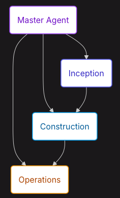

# Context

Trong phần này chúng ta sẽ đi tìm hiểu về các Phase của kiến trúc AI-DLC

AI-DLC phân rõ quy trình phát triển thành 3 giai đoạn (3 Phase)), mỗi giai đoạn sẽ đưa ra đàu ra output rõ ràng 

### Giai tạo Khởi tạo (Phase Inception)

Giai đoạn này ghi nhận các ý định, chi tiết hóa các yêu cầu và phân rã công việc thành các đơn vị có thể quản lý được. Giai đoạn này giúp chuyển đổi các mục tiêu cấp cao thành các hạng mục công việc được định nghĩa rõ ràng và có thể triển khai được.

#### Các hoạt động chính
- Ghi nhận Ý định (Intent Capture): Thu thập mục tiêu cấp cao, ví dụ: “Hệ thống xác thực người dùng”.
- Chi tiết hóa Yêu cầu (Requirement Elaboration): AI đưa ra các câu hỏi làm rõ, tự động tạo ra các user stories và các yêu cầu phi chức năng (NFRs).
- Xác định Bối cảnh Hệ thống (System Context): Định nghĩa các ranh giới, giao diện và các ràng buộc.
- Phân rã Đơn vị (Unit Decomposition): Chia nhỏ ý định thành các đơn vị có tính liên kết lỏng lẻo (loosely-coupled) và có thể phát triển độc lập.
- Lập kế hoạch Bolt (Bolt Planning): Lên kế hoạch cho các chu kỳ chớp nhoáng (bolts) cần thiết để triển khai từng câu chuyện người dùng.

#### Kết quả đầu ra 

| Tạo tác *(Artifact)* | Mô tả *(Description)* |
| :--- | :--- |
| **requirements.md** | Các câu chuyện người dùng, tiêu chí nghiệm thu, và các yêu cầu phi chức năng (NFRs). |
| **system-context.md** | Các ranh giới, giao diện và các ràng buộc của hệ thống. |
| **units.md** | Định nghĩa các Đơn vị (Units) đi kèm với các mối quan hệ phụ thuộc. |
| **Bolt Plans** | Danh sách các chu kỳ Bolt được sắp xếp theo thứ tự cho từng đơn vị. |

### Giai đoạn Xây Dựng (Phase Construction)

Đây là giai đoạn 2 của Flow, Trong giai đoạn này sẽ tiến hành thực thi các chu kỳ Bolt qua các giai đoạn đã được xác thực, thực hiện (implementation) tạo ra mã nguồn đã được kiểm thử và sẵn sàng vận hành thực tế (production-ready). Gia đoạn này giúp chuyển đổi các bản đặc tả thành mã nguồn chạy được và đã qua kiểm thử thông qua các giai đoạn có kỷ luật.

#### Các Giai Đoạn Trong Chu Kỳ (Bolt)
- Để giải thích rõ hơn thì mỗi loại Bolt sẽ tiến triển qua các giai đoạn được xác thực nghiêm ngặt:
    - Mô hình hóa Tên miền (Domain Model): Mô hình hóa logic nghiệp vụ bằng cách áp dụng các nguyên lý DDD:
        - Xác định các aggregate, entity, và value object.
        - Định nghĩa các sự kiện tên miền (domain events) và các lệnh (commands).
        - Thiết lập ngôn ngữ chung đồng nhất (ubiquitous language).
- Thiết kế Kỹ thuật (Technical Design)
    - Áp dụng các mẫu thiết kế và đưa ra các quyết định kiến trúc:
        - Lựa chọn các mẫu triển khai (implementation patterns).
        - Định nghĩa các giao diện (interfaces) và hợp đồng dữ liệu (contracts).
        - Lập kế hoạch cấu trúc dữ liệu.

- Phân tích ADR (ADR Analysis - Tùy chọn)
    - Ghi lại các quyết định kiến trúc quan trọng (Architectural Decision Records):
        - Bối cảnh và tuyên bố vấn đề.
        - Các phương án đã được cân nhắc.
        - Quyết định và lý do lựa chọn.
        - Hệ quả/Tác động của quyết định.
- Triển khai (Implement)
    - Tạo mã nguồn cho môi trường production:
        - Tuân thủ các tiêu chuẩn mã hóa (coding standards).
        - Áp dụng các mẫu thiết kế phù hợp.
        - Viết mã nguồn sạch, dễ bảo trì.
- Kiểm thử (Testing)
    - Xác minh tính chính xác:
        - Kiểm thử đơn vị (Unit tests) cho logic tên miền.
        - Kiểm thử tích hợp (Integration tests) cho các giao diện.
        - Kiểm thử chấp nhận (Acceptance tests) cho các câu chuyện người dùng.  
- Các Điểm Kiểm Soát Của Con Người (Human Checkpoints)
Việc xác thực của con người diễn ra tại mỗi điểm kiểm soát. AI sẽ đưa ra đề xuất, con người phê duyệt hoặc yêu cầu thay đổi. Điều này giúp ngăn chặn các lỗi sai sót lan truyền xuống các giai đoạn sau.

### Giai đoạn triển khai (Phase Operations)

giai đoạn này sẽ thực hiện việc deploy, verify và monitoring xuyên suốt.

Trong phase này tương tự như bạn làm với CI/CD:

- Đóng gói (Build): Biên dịch, đóng gói và chuẩn bị các hiện vật triển khai (deployment artifacts).
- Triển khai (Deploy): Triển khai lên môi trường mục tiêu (staging, production).
- Xác minh (Verify): Chạy các bài kiểm thử nhanh (smoke tests), kiểm tra tình trạng hệ - Health checks và xác thực.
- Giám sát (Monitor): Thiết lập hệ thống ghi nhật ký (logging), các chỉ số đo lường (metrics) và cảnh báo (alerting).

Kết qủa đầu ra 

| Tạo tác *(Artifact)* | Mô tả *(Description)* |
| :--- | :--- |
| **Deployment Units** | Các ứng dụng đã được container hóa hoặc đóng gói. |
| **Runbooks** | Các quy trình vận hành hệ thống. |
| **Monitoring Config** | Các bảng điều khiển *(dashboards)* và hệ thống cảnh báo. |

### Transition Condition Construction → Operations

Trong toàn bộ quá trình diễn ra và chuyển giao từ giai đoạn Construction → Operations,
để đảm bảo tới giai đoạn Operations được diễn ra tốt nhất, Agent cần đảm bảo 

#### Inception → Construction
- Tất cả các unit phải được làm rõ (clear).
- Các story phải rõ ràng về tiêu chí chấp thuận (acceptance criteria).
- Kế hoạch cho chu kỳ Bolt phải được duyệt chấp thuận.
- Các phụ thuộc phải ánh xạ thể hiện rõ.

#### Construction → Operations
- Tất cả các chu kỳ bolt đã hoàn thành và được đánh giá xác thực.
- Tất cả các story đều được kiểm thử (testing) và vượt qua (passing).
- Quá trình rà soát mã nguồn (code review) phải được đánh và và hoàn tất.
- Hệ thống tài liệu đã được cập nhật mới nhất.
