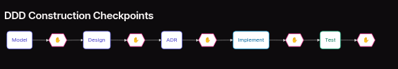
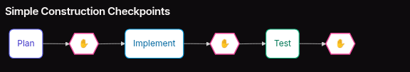

# Context

Trong phần này chúng ta sẽ đi sâu hơn và phân tích một số khái niệm như intent, bolt và unit trong AI-DLC
Trước tiên chúng ta sẽ tìm hiểu cách AI-DLC quản lý và lưu trữ context như nào

### Bank Memory

AI-DLC đưa ra thiết kê hệ thống Bank Memory để lưu trữ các thông tin dưới dạng tệp tin (file-based) cho tất cả các tạo tác (artifcat) của dự án với khả năng truy xuất nguồn gốc toàn diện (Traceability)
Các tạo tác (artifact) được lưu trữ dưới dạng markdown để thân thiện với người dùng (human reader) và thiết kê để đảm bảo AI có thể truy cập lấy thông tin (ngữ cảnh) nhanh chóng.

Dưới đây là cấu trúc lưu trữ tạo tác trong hệ thống memory bank
```bash
memory-bank/
├── intents/                   # Your captured intents
│   └── {intent-name}/
│       ├── requirements.md
│       ├── system-context.md
│       └── units/
│           └── {unit-name}/
│               ├── unit-brief.md
│               ├── stories/
│               └── bolts/
├── bolts/                     # Bolt execution records
│   └── {bolt-id}/
│       ├── domain-model.md
│       ├── technical-design.md
│       └── implementation/
├── standards/                 # Project standards
│   ├── tech-stack.md
│   ├── coding-standards.md
│   ├── architecture.md
│   └── ux-guide.md
└── operations/                # Deployment context
    ├── environments.md
    └── runbooks/
```

Có tất cả 4 loại tạo tác (artifact)
Trong đó
- Intents, bolt húng ta sẽ tìm hiểu sau đó.

- Standard là quy ước chuẩn về quy tắc techstack , guiding principle.
Ví dụ

##### tech-stack.md

```
# Tech Stack

## Languages
- **Primary**: TypeScript 5.x
- **Secondary**: Python 3.11+ (for ML pipelines)

## Frontend
- **Framework**: React 18 with Next.js 14
- **Styling**: Tailwind CSS
- **State**: Zustand

## Backend
- **Runtime**: Node.js 20 LTS
- **Framework**: Express.js
- **ORM**: Prisma

## Database
- **Primary**: PostgreSQL 15
- **Cache**: Redis 7
- **Search**: Elasticsearch 8

## Infrastructure
- **Cloud**: AWS
- **Containers**: Docker
- **Orchestration**: ECS Fargate
- **CI/CD**: GitHub Actions
```

##### architecture.md

```bash
# Architecture

## Style
- **Pattern**: Clean Architecture
- **API**: REST with OpenAPI 3.0
- **Communication**: Synchronous HTTP, async via SQS

## Layers
1. **Presentation**: Controllers, DTOs
2. **Application**: Use cases, services
3. **Domain**: Entities, value objects, events
4. **Infrastructure**: Repositories, external services

## API Design
- Resource-based URLs
- HTTP methods for actions
- JSON request/response bodies
- Pagination with cursor-based approach

## State Management
- Server state: React Query
- Client state: Zustand
- Form state: React Hook Form
```

Operations là tài liệu liên quan tới môi trường và hướng dẫn triển khai.

### Intent

Hiểu đơn gian intent là mục tiêu cần đạt được mà bạn hướng tới đối với quá trình phát triển.
Nó có thể là mục tiêu kinh doanh hay mục tiêu kỹ thuật hay chỉ gói gọn trong 1 tính năng feature.

Chiếu theo bạn có thể hiểu đơn giản nó đại biểu cho What - Bạn muốn xây đựng cái gì.

Ví dụ:
- Hệ thống xác thực người dùng (User Authentication System): Cho phép người dùng đăng ký, đăng nhập và quản lý tài khoản của họ một cách an toàn.
- Cổng thanh toán xử lý thanh toán (Payment Processing): Tích hợp cổng thanh toán để thực hiện các giao dịch an toàn.

#### Intent khi khởi tạo sẽ có cấu trúc như sau

```bash
memory-bank/intents/{intent-name}/
├── requirements.md      # User stories, acceptance criteria, NFRs
├── system-context.md    # Boundaries, interfaces, constraints
└── units/               # Decomposed units
    ├── {unit-1}/
    └── {unit-2}/
```

như bạn thấy intents sẽ tồn tại trong memory-bank, đối với chi tiết memory-bank chúng ta sẽ tìm hiểu ở các phần sau.
file `requirements.md` sẽ chưa các yếu cầu nghiệp vụ mô tả dưới dạng User story
ví dụ
```bash
# Intent: User Authentication System

## User Stories

### US-001: User Registration
As a new user, I want to register with email and password
so that I can create an account.

**Acceptance Criteria:**
- [ ] Email validation
- [ ] Password strength requirements
- [ ] Confirmation email sent

### US-002: User Login
...

## Non-Functional Requirements

### NFR-001: Security
- Passwords must be hashed with bcrypt
- Sessions expire after 24 hours
- Rate limiting on login attempts

### NFR-002: Performance
- Login response time < 500ms
- Support 1000 concurrent users
```

file `system-context.md` là nơi lưu trữ hính xác ngữ cảnh và các acceptance critieal cũng như các ràng buộc của mục tiêu

```bash
# System Context: User Authentication

## In Scope
- User registration and login
- Password reset flow
- Session management

## Out of Scope
- Social login (OAuth) - future intent
- Multi-factor authentication - future intent

## Interfaces
- REST API for frontend
- Database for user storage
- Email service for notifications

## Constraints
- Must use existing PostgreSQL database
- Must integrate with current session store
```

folder units sẽ chưa, để hiểu rõ hơn ta đi tìm hiểu units

### Units

Nếu như mapping tới agile thì intent ó thể coi như một epic. user story
thì units sẽ tượng chưng cho các task, phần công việc được phân rã từ epic, user story tứ là intent

#### Theo định nghĩa đơn vị units
- Một Đơn vị (Unit) là một phần công việc đồng nhất và khép kín được phân tách từ một Ý định. Các đơn vị này có tính liên kết lỏng lẻo (loosely coupled) và có thể được phát triển một cách hoàn toàn độc lập.
- Một Đơn vị tương tự như một Tên miền phụ (Subdomain) trong DDD hoặc một Epic trong Scrum, nhưng sở hữu các ranh giới rõ ràng hơn cùng khả năng phân rã được hỗ trợ bởi AI.

#### Unit có các đặc tính
- Tính đồng nhất (Cohesive): Tất cả các thành phần bên trong một đơn vị đều phục vụ cho một mục tiêu duy nhất và tập trung.
- Tính khép kín (Self-Contained): Có thể được phát triển và kiểm thử một cách độc lập.
- Liên kết ít chặt chẽ (Loosely Coupled): Phụ thuộc tối thiểu vào các đơn vị khác.
- Ranh giới rõ ràng (Well-Bounded): Có các giao diện kết nối (interfaces) minh bạch với phần còn lại của hệ thống.

Tiếp nối Intent trong phần cấu trúc ta có thể phân rã như sau

```bash
memory-bank/intents/user_authentiation_system/
├── requirements.md      # User stories, acceptance criteria, NFRs
├── system-context.md    # Boundaries, interfaces, constraints
└── units/               # Decomposed units
    ├── user_registration/
    │   ├── Registration form
    │   ├── Email validation
    │   └── Account creation
    └── user_login/
    │   ├── Login form
    │   ├── Session management
    │   └── Remember me
    └── password_management/
    │   ├── Password reset
    │   ├── Password change
    │   └── Password policies
    └── session_management/
        ├── Token handling
        ├── Session expiry
        └── Logout
```

đồng thời mỗi unit chia nhỏ đều có thư mục của riêng

```bash
memory-bank/intents/{intent}/units/{unit-name}/
├── unit-brief.md        # Unit definition and scope
├── stories/             # User stories for this unit
│   ├── story-001.md
│   └── story-002.md
└── bolts/               # Bolt execution records
    ├── bolt-001/
    └── bolt-002/
```

Trong đố file `unit-brief.md` sẽ chứa context ví dụ

```bash
# Unit: User Registration

## Purpose
Enable new users to create accounts in the system.

## Scope

### In Scope
- Email/password registration
- Email validation
- Account creation in database
- Welcome email

### Out of Scope
- Social login (separate unit)
- Profile management (separate unit)

## Dependencies
- Email Service (external)
- User Database (shared)

## Interfaces

### Inputs
- Registration form data (email, password)

### Outputs
- User account created
- Confirmation email sent

## Stories
- US-001: User Registration Form
- US-002: Email Validation
- US-003: Welcome Email
```

Note: một lưu ý là theo khuyến nghị thì các unit độc lập tuy nhiên trong thự tế, không phải lúc nào chũng cũng độc lập được mà có thể phụ thuộc vào nhau. Tuy nhiên cần lưu ý là nếu các đơn vị phụ thuộc phức tạp có thể gây ra Circular dependencies dẫn tới lặp liên tục khó xử lý, để tránh thì thay vì phân rã nhỏ ra có thể gộp chúng lại với nhau.

Ở phần trên ta thấy trong mỗi Unit lại có các folder bolt nhỏ hơn, lật lại các phần trước chúng ta biết răng AI-DLC diễn ra với tốc độ phát triển tính theo giờ, trong phần tiếp theo ta sẽ đi sâu vào bolt để hiểu nội dung hơn.

### Bolt

Quay trở lại định nghĩ, Bolt là phiên thực thi khung thời gian (time-box) để triển khai một cách nhanh chóng. Trong mô hình AI-DLC Bolt được thiết kế để thực hiện trong vài giờ đến vài ngày. Mỗi Bolt gói gọn một phạm vi công việc được định nghĩa rõ ràng và nằm gọn trong một đơn vị (Unit).

Note: Thuật ngữ "Bolt" được sử dụng nhấn mạnh vào tốc độ và sự chính xác, giống như một tia chớp, công việc diễn ra chớp nhoáng nhưng mang năng lượng cực kỳ tập trung. Các Bolt tương tự như các Sprint trong Scrum, nhưng được tối ưu hóa cho quy trình phát triển bởi AI.

#### Các Đặc Tính Của Một Bolt
- Nhanh chóng (Rapid): Tính bằng giờ hoặc ngày, không tính bằng tuần.
- Tập trung (Focused): Giải quyết một câu chuyện người dùng (story) hoặc một nhóm nhỏ các câu chuyện có liên quan chặt chẽ với nhau.
- Kiểm soát theo giai đoạn (Stage-Gated): Các điểm kiểm soát (checkpoints) được xác thực kỹ càng giúp ngăn chặn sai sót phát sinh.
- Hoàn chỉnh (Complete): Tạo ra mã nguồn chạy được và đã qua kiểm thử nghiệm thu.

### Bolt Type

Phần trước chúng ta cũng đã đè cập trong AI-DLC bolt được chia làm 2 loại

| Loại Bolt *(Bolt Type)* | Trường hợp sử dụng / Phù hợp nhất cho *(Best For)* | Các giai đoạn *(Stages)* |
| :--- | :--- | :--- |
| **DDD Construction** | • Xây dựng logic tên miền phức tạp với các quy tắc nghiệp vụ dày đặc.<br>• Tạo các ngữ cảnh bị ràng buộc (bounded contexts) với mô hình tên miền phong phú.<br>• Triển khai các dịch vụ đòi hỏi chuyên môn sâu về nghiệp vụ.<br>• Phát triển các chức năng cốt lõi của doanh nghiệp. | **1. Domain Model**:<br>• Identify aggregates, entities, value objects.<br>• Define domain events and commands.<br>• Establish ubiquitous language.<br>$\downarrow$<br>**2. Technical Design**:<br>• Choose implementation patterns.<br>• Define interfaces and contracts.<br>• Plan data structures and APIs.<br>$\downarrow$<br>**3. ADR Analysis**:<br>• Document significant decisions (Context, problem, options, and rationale).<br>$\downarrow$<br>**4. Implement**:<br>• Follow coding standards, apply design patterns, and write clean, documented code.<br>$\downarrow$<br>**5. Test**:<br>• Run Unit tests, Integration tests, and Acceptance tests. |
| **Simple Construction** | • Xây dựng các trang giao diện (frontend) và các thành phần UI.<br>• Tạo các đầu cuối CRUD (endpoints) đơn giản.<br>• Tích hợp với các API bên ngoài.<br>• Viết các mô-đun tiện ích (utilities) và hàm bổ trợ (helpers).<br>• Xây dựng các lệnh CLI hoặc kịch bản tự động hóa (scripts). | **1. Plan**:<br>• Review stories and requirements.<br>• List specific deliverables.<br>• Identify dependencies and define acceptance criteria.<br>$\downarrow$<br>**2. Implement**:<br>• Setup file structure.<br>• Implement core functionality and handle edge cases.<br>• Add documentation.<br>$\downarrow$<br>**3. Test**:<br>• Write unit tests, run test suite, verify acceptance criteria, and document results. |



Cấu trúc
```bash
memory-bank/bolts/{bolt-id}/
├── bolt.md                    # Bolt metadata and state
├── ddd-01-domain-model.md     # Domain model
├── ddd-02-technical-design.md # Technical design
├── adr-*.md                   # Architecture Decision Records (optional)
└── ddd-03-test-report.md      # Test results
```


```bash
memory-bank/bolts/{bolt-id}/
├── bolt.md                    # Bolt metadata and state
├── implementation-plan.md     # Plan from Stage 1
├── implementation-walkthrough.md # Developer notes from Stage 2
└── test-walkthrough.md        # Test results from Stage 3
```

