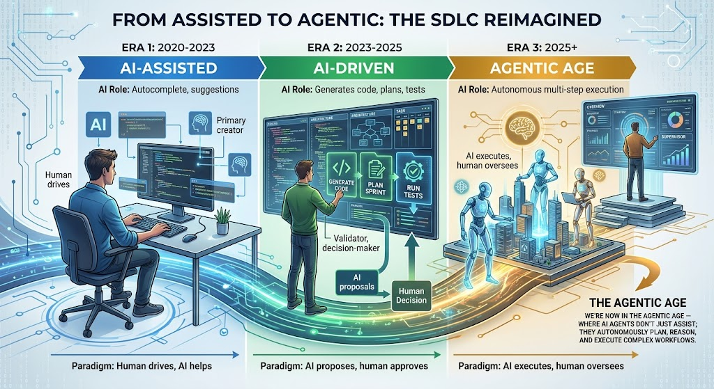
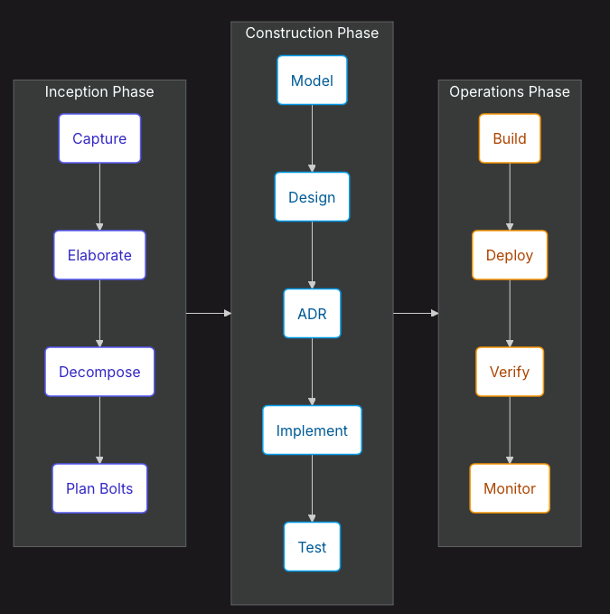

# Context

Trong phần này chúng ta sẽ tập trung đi vào phân tích và tìm hiểu về AI-DLC, đây là tầng cao nhất của Flow đặc biệt khi áp dụng Agentic AI vào SDLC

# Đinh nghĩa (Introduction)

AI-DLC hay AI Development Life Cycle tức vòng đời phát triển phần mềm định hướng bởi AI là một hệ phương pháp toàn diện dành cho việc phát triển phần mềm AI-native, phương pháp này ban đầu được định nghĩa bởi AWS với Amazon Q và sau là Kiro. Phương pháp này cung cấp khả năng truy vết toàn diện (traceability), tích hợp thiết kế hướng tên miền (DDD), và các giai đoạn có cấu trúc chặt chẽ dành cho các dự án phức tạp.
Đây là một phương pháp sẽ tái định nghĩa lại khi mà giờ con người sẽ giao tiép thông qua việc AI dẫn dắt hội thoại còn con người chỉ đưa ra các quyết định phê duyệt. Khác với mô hình Agile truyền thống khi các phân đoạn lặp (iterations) kéo dài hàng tuần (2-4 tuần) nơi con người sẽ manage quản lý task thông qua các cộng cụ 


AI-DLC vận hành theo các Bolt, bản chất là các chu kỳ lặp siêu tốc được tính bằng giờ hoặc bằng ngày và AI sẽ tự động cân bằng dẫn dắt và con ngươi đóng vi trò giám sát ra quyết định.


Để làm rõ và nhấn mạnh hơn với AI Native và AIDLC ta so sánh với SDLC truyền thống (Traditional) Water Fall và Agile. Trong nhiều năm trở lại đây với sự phát triển nhanh chóng của Agile , đặc biệt là Scrum với việc sử dụng cá khung chu kỳ (Sprints) và ước tính thời gian qua các Story point đã giúp cho việc phát triển phần mềm nhanh chóng rút xuống từ tháng tới 2-4 tuần. Tuy vậy vơi sự phát triển của AI, chi phí phát triển phần mềm tiếp cận zero điều này làm cho phá vỡ hoàn toàn, việc viết một phần mềm hay ý tưởng (prototype) giờ đây chỉ tính bằng giờ, ngày. Việc áp AI vào Agile với chu kỳ sprint 2-4 tuần khiến cho AI bị ràng buộc kém hiệu quả hơn rất nhiều KHi một ý tưởng hay một tính năng chỉ thực hiện đúng trong 12h với AI thì việc chờ thêm tới tận 12-13 ngày thực sự là quá lãng phí. Một minh chứng đó là kể từ khi 2023 với sự bùng nổ của ChatGPT và OpenAI đã khiến cho thế giới công nghệ thay đổi, kể từ 2023 tới nay chúng ta dã trải qua rất nhiều cách vận dụng AI khác xa so với AI trước đó với ML hay DeepLEarning 



Do đó để làm rõ ta so sánh thêm 

| Chỉ số truyền thống | Vấn đề trong Kỷ nguyên AI |
| :--- | :--- |
| **Điểm cốt truyện (Story Points)** | Thời gian thực thi của AI không có bất kỳ mối tương quan nào với các ước tính về nỗ lực của con người. |
| **Tốc độ (Velocity)** | Biến động dữ dội dựa trên mức độ sử dụng công cụ AI, chứ không phải năng lực của đội ngũ. |
| **Lập kế hoạch Sprint (Sprint Planning)** | Tạo ra sự trì hoãn nhân tạo cho những công việc đã hoàn thành nhưng phải chờ đợi các buổi họp nghi lễ. |
| **Họp đứng hàng ngày (Daily Standups)** | Tiêu tốn thời gian để chia sẻ những thông tin mà các hệ thống tự động có thể hiển thị ngay lập tức. |


SDLC với AI đã thay đổi do đó cần phải có một SLDC mindset mới, từ thực tiễn đố AWS đã thu thập và xây dựng nên một phương pháp luận hoàn chỉnh, sẵn sàng cho môi trường vận hành thực tế (production) với AI-DLC, để giải quyết vấn đề của phương pháp truyển thống luôn tồn tại trong Agile 
- Các quyết định kiến trúc thiếu nhất quán.
- Tài liệu thiết kế bị bỏ sót hoặc thiếu hụt.
- Các vấn đề về chất lượng do các bước bị bỏ qua.
- Mất mát bối cảnh (context loss) giữa các chu kỳ lặp.

Vậy một câu hỏi đặt ra, DDD hay tài liệu thiết kế trong Agile cũng có. Đúng vậy tuy nhiên trong Agile các thiết kế như DDD (Domain-Driven Design) chỉ mang tính tùy chọn. Nhiều đội ngũ thường bỏ qua chúng do áp lực về mặt thời gian, dẫn đến việc tích tụ nợ kỹ thuật (technical debt). Ngược lại thiết kế DDD được tích hợp sẵn vào các chu kỳ xây dựng chớp nhoáng (DDD construction bolts). Bạn không thể bỏ qua bước mô hình hóa tên miền (Domain Modeling), đây là một gate bắt buộc phải đánh giá (review).


# AI-DLC 

Trong phần này chúng ta sẽ đi tìm hiểu AI-DLC , mục tiêu và cách sử dụng.

Mục tiêu mà AI-DLC hướng tới:
- Trong trường hợp chúng ta cần khả năng tuy vết toàn diện (traceability), bất kỳ 1 thay đổi nào đều được lưu trữ để chúng ta có thể kiểm tra lại khi cần.
- Làm việc với DĐD, hiểu được Bussiness, về cơ bản việc áp dụng DDD khá phức tạp đòi hỏi người tham gia phải hiểu và áp dụng, đặc biệt trong các dự án phức tạp
- Khi dự án có nhiều team cần phối hợp với nhai 

Nguyên tắc tiếp cận AI-DLC
**Định hướng bởi AI (AI-Driven)**
- AI sẽ dẫn dắt cuộc hội thoại, đề xuất giải pháp và tạo ra các thành phẩm (artifacts). Con người thực hiện xác thực và định hướng.
**Chu kỳ lặp siêu tốc (Rapid Iterations)**
- Các "Bolt" sẽ thay thế cho các "Sprint". Hoàn thành các khối lượng công việc có ý nghĩa chỉ trong vài giờ, không phải vài tuần.
**Điểm kiểm tra của con người (Human Checkpoints)**
- Sự phê duyệt từ con người tại mỗi điểm kiểm tra giúp phát hiện và ngăn chặn các lỗi sai trước khi chúng tạo ra hiệu ứng dây chuyền.
**Thiết kế trước tiên (Design-First)**
- Phương pháp thiết kế hướng tên miền (Domain-Driven Design) được tích hợp sẵn vào ngay trong các "construction bolts", chứ không phải là một yếu tố bổ sung sau khi đã hoàn thành.

### Tương tự như các Flow khác, AI-DLC cũng chia ra làm 3 Phase 



| Giai đoạn <br>*(Phase)* | Tác nhân <br>*(Agent)* | Phương thức / Nghi thức <br>*(Ritual)* | Thời lượng <br>*(Duration)* | Kết quả đầu ra <br>*(Output)* |
| :--- | :--- | :--- | :--- | :--- |
| **Inception** <br>*(Khởi tạo)* | Inception Agent | Mob Elaboration <br>*(Chi tiết hóa tập thể)* | Vài giờ | Intents *(Ý định)* $\rightarrow$ Units *(Đơn vị)* $\rightarrow$ Stories *(Câu chuyện)* $\rightarrow$ Bolt Plans *(Kế hoạch chớp nhoáng)* |
| **Construction** <br>*(Xây dựng)* | Construction Agent | Mob Construction <br>*(Xây dựng tập thể)* | Vài giờ / Vài ngày *(Bolts)* | Domain Models *(Mô hình miền)* $\rightarrow$ Code *(Mã nguồn)* $\rightarrow$ Tests *(Kiểm thử)* |
| **Operations** <br>*(Vận hành)* | Operations Agent | Continuous <br>*(Liên tục)* | Diễn ra liên tục | Deployments *(Triển khai)*, Monitoring *(Giám sát)*, Maintenance *(Bảo trì)* |
Trong đó 

### Mục Đích (Intent)

Mô tả rõ ràng mục tiêu mà hướng tới

```yaml
intent:
  id: 001-user-authentication
  title: User Authentication System
  status: in_progress
```

### Đơn vị (Unit)

define rõ các module mà có thể phát triển độc lập tách dời (loosely-coupled)

### Story 

tưởng tự ta sử dụng User Story để mô tả hành vị mong muốn và các tiêu chí châp thuận 

### Bolt

luồng thực thi theo khung thời gian (timebox), được định nghĩ để thực hiện đối với một story

| Sprints *(Truyền thống)* | Bolts *(AI-DLC)* |
| :--- | :--- |
| Kéo dài 2-4 tuần | Vài giờ hoặc vài ngày |
| Khung thời gian cố định *(Fixed timeboxes)* | Linh hoạt, thúc đẩy bởi ý định *(Intent-driven)* |
| Đo lường bằng Tốc độ *(Velocity)* | Đo lường bằng Giá trị kinh doanh *(Business value)* |
| Ước tính bằng Điểm cốt truyện *(Story points)* | AI thực thi, con người xác thực |

Trong luồng Bolt định nghĩa 

| Loại Bolt *(Bolt Type)* | Phù hợp nhất cho *(Best For)* | Các giai đoạn *(Stages)* |
| :--- | :--- | :--- |
| **DDD Construction** | Logic tên miền phức tạp, các quy tắc nghiệp vụ | Mô hình hóa *(Model)* $\rightarrow$ Thiết kế *(Design)* $\rightarrow$ Tài liệu quyết định kiến trúc *(ADR)* $\rightarrow$ Triển khai *(Implement)* $\rightarrow$ Kiểm thử *(Test)* |
| **Simple Construction** | Giao diện người dùng (UI), tích hợp hệ thống, các công cụ tiện ích | Lập kế hoạch *(Plan)* $\rightarrow$ Triển khai *(Implement)* $\rightarrow$ Kiểm thử *(Test)* |


Tương tự FIRE, AI-DLC cũng define ra 4 Agent để triển khai 

| Tác nhân *(Agent)* | Giai đoạn *(Phase)* | Trách nhiệm *(Responsibility)* |
| :--- | :--- | :--- |
| **Master** | All *(Tất cả)* | Điều phối toàn bộ quy trình, định tuyến các yêu cầu, duy trì nhận thức hệ thống |
| **Inception** | Inception *(Khởi tạo)* | Ghi nhận các mục đích (intents), xây dựng chi tiết các yêu cầu, lập kế hoạch chớp nhoáng (bolt plans) |
| **Construction** | Construction *(Xây dựng)* | Thực thi các kế hoạch thông qua các giai đoạn của phương pháp DDD |
| **Operations** | Operations *(Vận hành)* | Đóng gói (build), triển khai (deploy), xác thực (verify), giám sát hệ thống (monitor) |

## Cấu trúc của AI-DLC

```yaml
memory-bank/                   # AI-DLC artifacts
├── intents/                   # Captured intents
│   └── {intent-id}/
│       ├── requirements.md
│       ├── system-context.md
│       └── units/
│           └── {unit-id}/
│               ├── unit-brief.md
│               └── stories/
├── bolts/                     # Bolt execution records
├── standards/                 # Project standards
│   ├── tech-stack.md
│   ├── coding-standards.md
│   ├── system-architecture.md
│   └── ...
└── operations/                # Deployment context
```

## Vậy đẻ ứng dụng AI-DLC tốt ta cần phải làm gì 
- Khi bạn có một đội ngũ đòi hỏi sự phối hợp chặt chẽ.
- Logic nghiệp vụ (domain logic) của bạn phức tạp và được hưởng lợi từ mô hình DDD.
- Bạn cần hệ thống tài liệu toàn diện và khả năng truy vết nguồn gốc (traceability).
- Bạn đang làm việc trong một môi trường bị kiểm soát chặt chẽ với các yêu cầu kiểm toán khắt khe.

# AI-DLC & Context Engineering

Tiếp theo ta sẽ đi vào tìm hiểu về context engineering , đây là một thuật ngữ mới và một thành phần qua trong trong AI Agentic.

Như trước đố ta biết một trong những thách thức lớn nhất của mô hình Agile truyền thống là hiện tượng mất mát bối cảnh (context loss) giữa các chu kỳ sprint. Kiến thức trôi theo các thành viên khi họ rời đội ngũ, các quyết định không được ghi chép lại thành tài liệu, và toàn bộ kho mã nguồn (codebase) dần trở thành một ẩn số.

Để giải quyết vấn đề này, AI-DLC sử dụng lưu trữ context trên một tập các file markdown để agent hiểu và nạp vào bộ nhớ thông qua Specs và Memory Bank 

#### Specs + Memory Bank

- Lưu trữ thông tin tất cả các artifact dự án (requirements, designs, decisions)
- truy vết (Traceability) giữa các artifacts
- Cung cấp context để agent có thể tải (reload) ở bất kỳ phiên hoạt động (session)

```bash
memory-bank/
├── intents/           # What we're building
├── bolts/             # How we built it
├── standards/         # Project decisions
└── operations/        # Deployment context
```

#### Agile & AI-DLC

| Khái niệm Agile *(Agile Concept)* | Khái niệm tương đương trong AI-DLC *(AI-DLC Equivalent)* |
| :--- | :--- |
| **Epic** | Ý định *(Intent)* |
| **User Story** | Câu chuyện *(Story - nằm trong Đơn vị / Unit)* |
| **Sprint** | Chu kỳ chớp nhoáng *(Bolt)* |
| **Backlog** | Định nghĩa Ý định/Đơn vị *(Intent/Unit definitions)* |
| **Definition of Done (DoD)** | Xác thực điểm kiểm soát *(Checkpoint validations)* |

