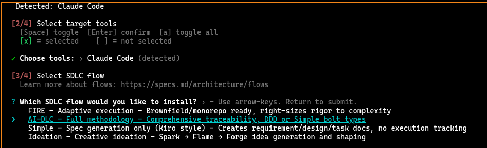
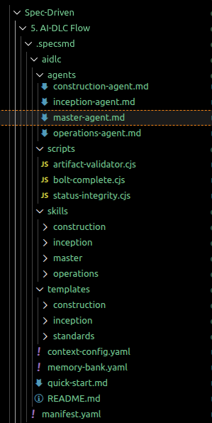
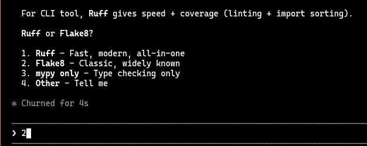
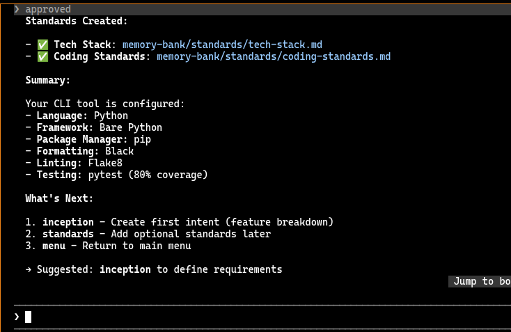
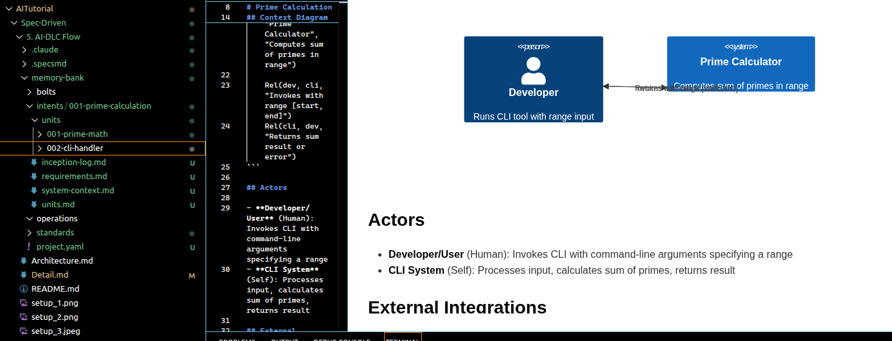
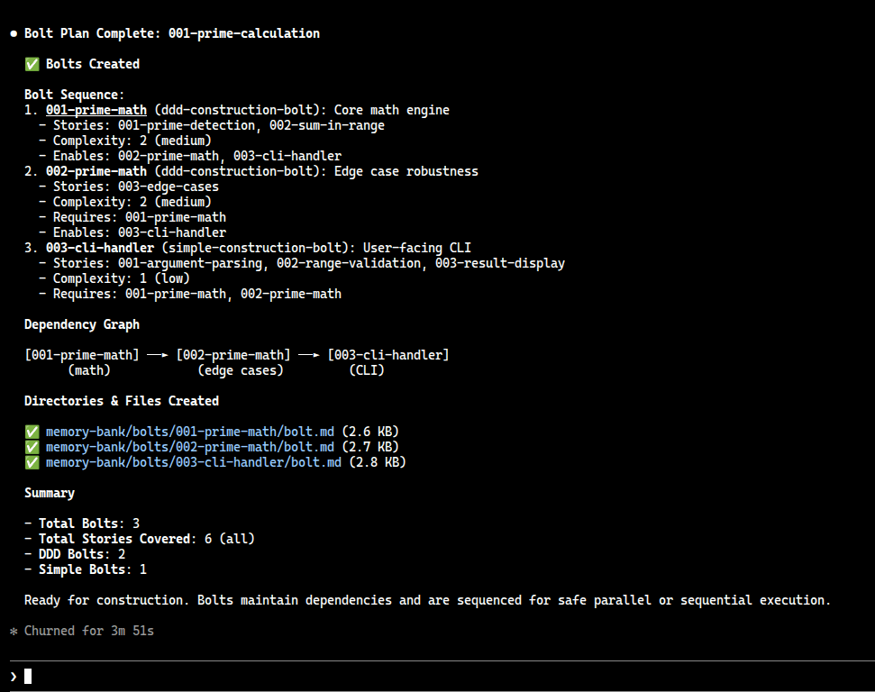
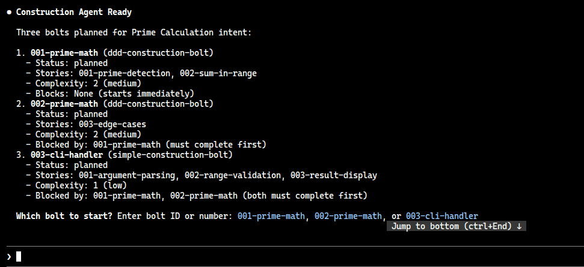
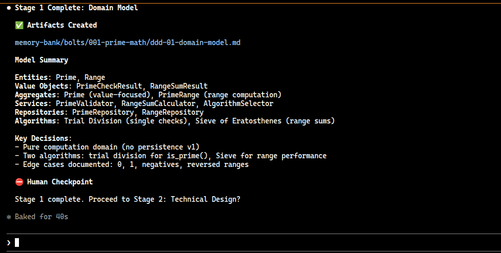

# Context

Trong phần này chúng ta sẽ đi vào thực hiện tạo một project với cấu trúc AI-DL flow với dạng bài tính tổng các số nguyên số tố.

# Cài đặt và sử dụng

## Yêu cầu cài đặt (Prerequisites)
- Node.js > 18
- Python >= 3.9
- Claude Code cli hoặc IDE như Cursor, VSCode

## Thực hiện

Bước 1: khởi tạo context cho AI-DLC Flow

Sau đó chúng ta chạy lệnh
```bash
npx specsmd@latest install
```



Nội dung sẽ được tạo ra theo đúng cấu trúc mà ta đã tìm hiểu



Bước 2: Khởi tạo project

mở IDE hay claude console lên và hạy lệnh

```bash
/specsmd-master-agent
```

sau đó gõ

```bash
project-init
```

agent sẽ đọc context file và hỏi loại app mà muốn tạo.
trong phần này ta tạo cli-tool để demo thôi + ngôn ngữ Python. Tại đây hãy thực hiện approve hay cấp thông tin để tạo standard rules trước khi bắt đầu story.






Bước 3: Sau khi đã tạo standard rules xong, chuyển tiếp tới phase inception

thực hiện gõ

```bash
/specsmd-inception-agent intent-create
```

Tương tự agent sẽ hỏi, dẫn dắt bạn mô tả thông tin cần thiết để hoàn thành các bước trong inception phase và tạo ra unit trong memory bank.



Bước 4: Đánh giá rà soát lại thông tin trong file markdown và kiểm tra bolt

```bash
/specsmd-inception-agent bolt-plan
```



Cấu trúc file bolt generate ra

```markdown
---
id: 001-prime-math
unit: 001-prime-math
intent: 001-prime-calculation
type: simple-construction-bolt
status: planned
stories:
  - 001-prime-detection
  - 002-sum-in-range
  - 003-edge-cases
created: 2026-07-06T00:00:00Z
started: null
completed: null
current_stage: null
stages_completed: []

requires_bolts: []
enables_bolts: [002-cli-handler]
requires_units: []
blocks: false

complexity:
  avg_complexity: 2
  avg_uncertainty: 1
  max_dependencies: 1
  testing_scope: 2
---

# Bolt: 001-prime-math

## Overview

Core mathematical engine for prime number detection and summation. This bolt implements the foundational algorithms that will be called by the CLI interface.

## Objective

Implement fast, correct algorithms for detecting prime numbers and calculating their sum within ranges, with comprehensive handling of edge cases.

## Stories Included

- **001-prime-detection**: Implement prime detection for single number (Must)
- **002-sum-in-range**: Implement sum calculation for range (Must)
- **003-edge-cases**: Handle edge cases and boundary conditions (Must)

## Bolt Type

**Type**: simple-construction-bolt

**Stages**:
1. Implementation - Write functions and logic
2. Testing - Unit tests, acceptance criteria verification
3. Completion - Code review, finalization

## Dependencies

### Requires
- None (foundational bolt)

### Enables
- Bolt 002-cli-handler (CLI needs math engine to call)

## Success Criteria

- [ ] All 3 stories implemented and working
- [ ] All acceptance criteria from stories met
- [ ] Unit tests written and passing (coverage > 80%)
- [ ] Edge cases handled correctly
- [ ] Range 1-10000 sum calculated in < 100ms
- [ ] Code reviewed and approved

## Expected Outputs

- `prime_math.py` - Module containing:
  - `is_prime(n)` function
  - `sum_primes_in_range(start, end)` function
- `test_prime_math.py` - Comprehensive test suite
- Documentation of algorithms and assumptions

## Implementation Notes

- **Prime Detection**: Trial division (simple, O(√n))
- **Range Summation**: Sieve of Eratosthenes (faster for large ranges, O(n log log n))
- **Edge Cases**: Handle 0, 1, 2, negatives, large numbers
- **No External Libraries**: Pure Python only
- **Performance Target**: 1-10000 in < 100ms

## Risks & Mitigations

| Risk | Probability | Impact | Mitigation |
|------|-------------|--------|-----------|
| Algorithm complexity | Low | Performance miss | Use Sieve for large ranges |
| Edge case oversights | Medium | Correctness issues | Exhaustive test cases |
| Integer overflow (very large n) | Low | Calculation errors | Test with sys.maxsize |

## Notes

- This is the foundation for all calculation logic
- Quality and correctness are more important than v1 performance
- v2 can add caching/memoization if needed
- Thoroughly test before moving to CLI handler
```

Sau khi kiểm tra điều kiện nội dung file plan không có bất kỳ vấn đề nào, chúng ta có thể chuyển sang giai đoạn thực hiện

```bash
/specsmd-construction-agent bolt-start
```

hệ thống sẽ suggest thông tin trình tự thực hiện



Lựa chọn 1 sau đó thực hiện, tãi mỗi điểm human checkpoint sẽ xuất hiện để người dùng có thể kiểm tra và điều chỉnh nếu cần



tiếp tục lặp lại bolt sẽ đi qua từng stage

Domain Model -> Technical Design -> ADR Analysis -> Implement -> Test

Sau cùng chúng ta sẽ có một source đươc thực hiện generate code và testing.

```yaml
memory-bank/                   # Created after project-init
├── intents/                   # Your captured intents
│   └── {intent-name}/
│       ├── requirements.md
│       ├── system-context.md
│       └── units/
├── bolts/                     # Bolt execution records
├── standards/                 # Project standards
│   ├── tech-stack.md
│   ├── coding-standards.md
│   └── ...
└── operations/                # Deployment context
```

Một lưu ý nếu trong quá trình chạy mà bạn gặp lỗi khiến cho agent bị ngắt thì đừng lo
về cơ bản Agent được động theo cơ chế không lưu trạng thái (stateless), mà thay vào đó chúng sẽ đọc các tạo tác (artifacts) từ Memory Bank khi khởi động. Chỉ cần bạn đảm bảo các artifacts đã được lưu lại sau mỗi bước.
Nếu trường hợp bolt bị stuck ở 1 stage, để kiểm tra hãy xài lệnh `bolt-status` để kiểm tra giai đoạn hiện tại. Nếu quá trình xác thực (validation) thất bại, hãy xử lý các phản hồi lỗi và tiếp tục bằng lệnh bolt-start.
Trường hợp bạn muốn replan lại bolt có thể replan bằng lệnh `/specsmd-inception-agent bolt-replan`. Thao tác này sẽ tạo ra một bolt mới cho cùng các user stories đó.
Khi bạn chạy song nhiều intent, hãy kiểm tra bằng lệnh `/specsmd-master-agent analyze-context`


