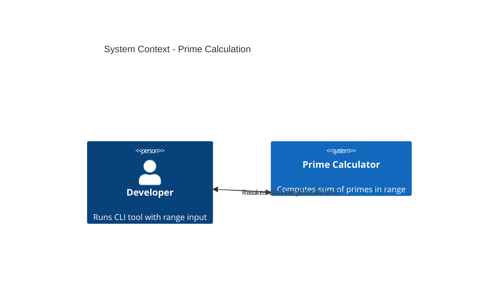

# Prime Calculation - System Context

## System Overview

Standalone Python CLI utility that calculates the sum of all prime numbers within a specified numerical range. The system receives a range as input and outputs the calculated sum with correctness as the primary success metric.

## Context Diagram

## Actors

- **Developer/User** (Human): Invokes CLI with command-line arguments specifying a range
- **CLI System** (Self): Processes input, calculates sum of primes, returns result

## External Integrations

**None** - Standalone CLI tool with no external dependencies or integrations

## High-Level Constraints

- **Language**: Python 3.9+
- **No External Libraries**: Core logic built from scratch (no sympy, numpy, etc.)
- **Single-file Distribution**: Users run script directly
- **Offline-only**: No network calls needed

## Key NFR Goals

- **Correctness**: 100% accurate results matching reference prime sets
- **Performance**: Range 1-10000 computed in < 100ms
- **Simplicity**: Minimal dependencies, easy to understand code
- **Portability**: Runs anywhere Python is installed
